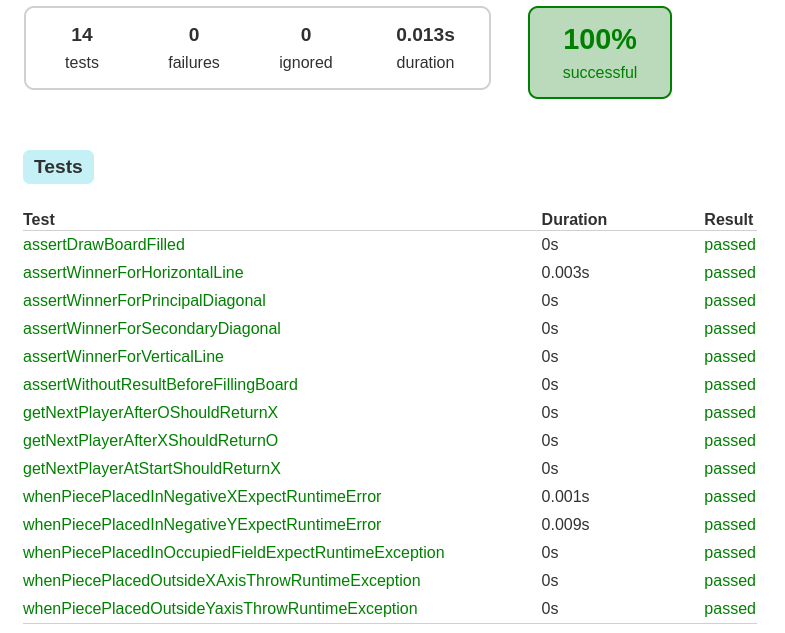

<link rel="stylesheet" href="/style.css"/>

# Test-driven Development

## Chapter 1

TDD is a simple procedure of writing tests **before the actual implementation**. It's an inversion of a traditional approach where testing is performed after the code is written.

**Red-green-refactor**: Test-driven development is a process that relies on the repetition of a very short development cycle. It is based on the test-first concept of extreme programming that encourages simple design with a high level of confidence. While writing tests we're in the red state, when the implementation of a test is finished, all tests should pass and then we'll be in the green state.

> When a test fails, the programmer should spend little time trying to fix it. So, if the change can't be done in a matter of minutes it's better to revert the changes and start over.

After all tests are passing, it's time to refactor the code, if the refactor breaks an existing functionality the tests will show and the changes must be reverted.

### Speed is the key

The first implementation should not be focused on perfection, the idea is to keep switching between tests and implementation as fast as a game of ping-pong.

> The time between changing from tests to implementation should be measured in minutes or seconds.

TDD is a solution to approach the design in a different way, in such the programmer is forced to think about the implementation and about what the code needs to do before implementation. The main objective of TDD is testable code design with tests as a very useful side product.

> Tests that are defined by an already existing application are biased. They have a tendency to confirm what code does, and not to test whether client's expectations are met, or that the code is behaving as expected.

### Mocking

In order for tests to run fast and provide constant feedback, code needs to be organized in such a way that the methods, functions, and classes **can be easily replaced with mocks and stubs**. With or without mocks, the code should be written in a way that we
can easily replace one dependency with another.

## Chapter 3 - Red-Green State

The following code extracts use this structure:

```java title="TicTacToe.java" linenums="1"
--8<--
tdd-ch3/src/main/java/TicTacToe.java:setup
--8<--
}
```

### Requirement 1

A piece can be placed on any empty space of a 3×3 board.

#### REQ1 - Red State

Tests for this requirement:

```java title="TicTacToeSpec.java" linenums="1"
--8<--
tdd-ch3/src/test/java/TicTacToeSpec.java:req1
--8<--
```

#### REQ1 - Green State

Implementation passing all tests and after refactoring.

```java title="TicTacToe.java" linenums="1"
--8<--
tdd-ch3/src/main/java/TicTacToe.java:req1
--8<--
```

### Requirement 2

There should be a way to find out which player should play next.

#### REQ2 - Red State

Tests for this requirement:

```java title="TicTacToeSpec.java" linenums="1"
--8<--
tdd-ch3/src/test/java/TicTacToeSpec.java:req2
--8<--
```

#### REQ2 - Green State

Implementation passing all tests and after refactoring.

```java title="TicTacToe.java" linenums="1"
--8<--
tdd-ch3/src/main/java/TicTacToe.java:req2
--8<--
```

### Requirement 3

A player wins by being the first to connect a line of friendly pieces from one side or corner of the board to the other.

#### REQ3 - Red State

Tests for this requirement:

```java title="TicTacToeSpec.java" linenums="1"
--8<--
tdd-ch3/src/test/java/TicTacToeSpec.java:req3
--8<--
```

#### REQ3 - Green State

Implementation passing all tests and after refactoring.

```java title="TicTacToe.java" linenums="1"
--8<--
tdd-ch3/src/main/java/TicTacToe.java:req3
--8<--
```

### Requirement 4

The result is a draw when all the boxes are filled.

#### REQ4 - Red State

Tests for this requirement:

```java title="TicTacToeSpec.java" linenums="1"
--8<--
tdd-ch3/src/test/java/TicTacToeSpec.java:req4
--8<--
```

#### REQ4 - Green State

Implementation passing all tests and after refactoring.

```java title="TicTacToe.java" linenums="1"
--8<--
tdd-ch3/src/main/java/TicTacToe.java:req3
--8<--
```

### Jacoco Report

<center>



<fig>Results after running `gradle test jacocoReport`</fig>
</center>

## Chapter 6 - Mocking

While focused on units, we must try to remove all dependencies that a unit might use. Removal of those dependencies is accomplished through a combination of design and mocking.

Mocks are useful in situations such as:

- Objects generating nondeterministic results, such as `java.util.Date`;
- Objects that don't already exist, such as interface elements;
- Objects with slow processing, such as databases.

**Mock objects** simulate the behavior of real (often complex) objects. They allow us to create an object that will replace the real one used in the implementation code.

The following code extracts use this structure. The Bean represents the DB's Entity.

```java title="TicTacToeBean.java" linenums="1"
--8<--
tdd-ch6/src/main/java/mongo/TicTacToeBean.java:setup
--8<--

```

### Requirement 1

Implement an option to save a single move with the turn number, the X and Y axis positions, and the player (X or O).

#### REQ1 - Red State

Tests for this requirement:

```java title="TicTacToeCollectionSpec.java" linenums="1"
--8<--
tdd-ch6/src/test/java/mongo/TicTacToeCollectionSpec.java:req1
--8<--
}
```

#### REQ1 - Green State

Implementation passing all tests and after refactoring.

```java title="TicTacToeCollection.java" linenums="1"
--8<--
tdd-ch6/src/main/java/mongo/TicTacToeCollection.java:req1
--8<--
}
```

<!-- ### Requirement 2

Save each turn to the database

#### REQ2 - Red State

Tests for this requirement:

```java title="TicTacToeSpec.java" linenums="1"
--8<--
tdd-ch6/src/test/java/main/TicTacToeSpec.java:req2
--8<--
```

#### REQ2 - Green State

Implementation passing all tests and after refactoring.

```java title="TicTacToe.java" linenums="1"
--8<--
tdd-ch6/src/main/java/TicTacToe.java:req2
--8<--
``` -->

## References

[1] Test-Driven Java Development, Second Edition: Invoke TDD Principles for End-To-end Application Development, 2nd Edition, by Viktor Farcic, and Alex Garcia.
