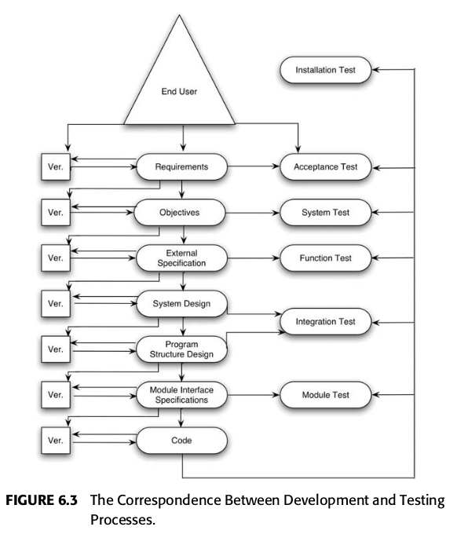

## Higher-Order Testing

- Module-testing não é o fim do processo de testes;
- Erros ocorrem quando o software não faz o que o usuário final espera;
- Testes adicionais, conhecidos por higher-order tests, são necessários para completar o processo de teste.

- Criação de software envolve a tradução de informações sobre o programa do nível conceitual ao concreto;
- Muitos erros ocorrem por ruídos e erros durante essa tradução.
- O processo de desenvolvimento de software envolve diversos passos, e é possível realizar testes em cada um deles.

<fig>Relação entre os níveis de teste e as etapas do processo de desenvolvimento.(Fonte: [1])</fig>

### Testes de Aceitação

- Testes de aceitação comparam o programa com os seus requisitos iniciais e as necessidades atuais dos seus usuários finais.
- São realizados, tipicamente, pelo cliente ou usuário final, e não pela organização que desenvolveu o programa.
- Quando existe um contrato, o programa é comparado com o contrato original.
- Embora a responsabilidade dos testes de aceitação seja do usuário final, o desenvolvedor pode conduzir os testes de usuário durante o ciclo de desenvolvimento para identificar e resolver problemas antes de entregar a versão final ao usuário.

### Testes de Sistema

- Visa identificar discrepâncias no sistema em relação aos seus objetivos originais. Ou seja, é focado em demonstrar como o programa, como um todo, falha em atender os objetivos originais.
- Para realização de testes de sistema, é essencial que o produto possua objetivos mensuráveis e registrados.
- Durante essa etapa é importante identificar erros de tradução durante a criação da especificação externa.
- Os casos de teste não são derivados da especificação externa, mas sim da análise da documentação do usuário.
- A criação dos casos de teste não é trivial e não há um conjunto de metodologias, como nos testes funcionais, sendo uma atividade que exige criatividade, inteligência e experiência do testador.
- As 15 categorias de teste da tabela a seguir podem aparecer nos testes de sistema, e recomenda-se a utilização da maior quantidade possível.

| Categoria        | Descrição                                                                                                                       |
| ---------------- | ------------------------------------------------------------------------------------------------------------------------------- |
| Funcionalidade   | Garantir que a funcionalidade descrita nos objetivos esteja implementada.                                                       |
| Volume           | Submeter o programa a volumes anormalmente grandes de dados para processamento.                                                 |
| Estresse         | Submeter o programa a cargas anormalmente grandes, geralmente processamento paralelo.                                           |
| Usabilidade      | Avaliar o quão bem o usuário final consegue interagir com o programa.                                                           |
| Segurança        | Tentar subverter as medidas de segurança do programa.                                                                           |
| Desempenho       | Verificar se o programa atende aos requisitos de tempo de resposta e taxa de transferência.                                     |
| Armazenamento    | Assegurar que o programa gerencie corretamente suas necessidades de armazenamento (sistema e físico).                           |
| Configuração     | Verificar se o programa funciona adequadamente nas configurações recomendadas.                                                  |
| Compatibilidade  | Avaliar se as novas versões do programa são compatíveis com versões anteriores.                                                 |
| Instalação       | Garantir que os métodos de instalação funcionem em todas as plataformas suportadas.                                             |
| Confiabilidade   | Verificar se o programa atende às especificações de confiabilidade, ex: tempo de atividade e MTBF (mean time between failures). |
| Recuperação      | Testar se as facilidades de recuperação do sistema funcionam conforme o projetado.                                              |
| Manutenibilidade | Avaliar se o aplicativo fornece corretamente mecanismos para obter dados sobre eventos que requerem suporte técnico.            |
| Documentação     | Validar a precisão de toda a documentação do usuário.                                                                           |
| Procedimento     | Verificar a precisão de procedimentos especiais necessários para usar ou manter o programa.                                     |

### Testes Funcionais

- Visa **identificar discrepâncias** entre o programa e a sua especificação externa (descrição do comportamento do programa do ponto de vista do usuário final).
- Primariamente uma atividade de caixa-preta, mas que utiliza critérios caixa-branca de cobertura de lógica.
- Os casos de teste são derivados da especificação.
- Métodos como particionamento em equivalências, análise do valor limite, grafos de causa-efeito e error-guessing são relevantes durante testes funcionais.
- É importante registrar funções que apresentam a maior quantidade de erros, pelo fator da localidade dos erros.

### Teste de Instalação

- Visa identificar erros durante o processo de instalação, como por exemplo erros nas seleções do usuário, alocação de arquivos, carregamento, requisitos de hardware e conectividade.
- A organização desenvolvimento o sistema é responsável por estes testes, devendo criá-los e incluí-los como parte do sistema.
- Os casos de teste devem verificar compatibilidade, componentes do sistema, integridade de arquivos e configuração adequada de hardware.
