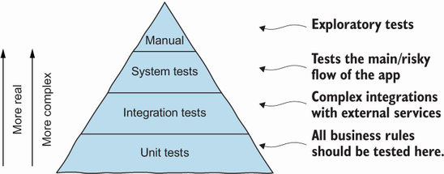

# Psicologia e Economia em Testes de Software

## Psicologia

Com frequência testas são definidos como processos para "demonstrar que um software funciona sem problemas" ou "
demonstrar a ausência de erros no software", por exemplo, sendo estas definições equivocadas, visto que o processo de
testes visa agregar valor a um programa, aumentando sua qualidade e confiabilidade, por meio da remoção de erros. Para
que esse objetivo seja alcançado, o testador deve partir da premissa de que o programa possui erros e então testá-lo
para encontrar a maior quantidade de erros possível.

A definição de um objetivo está intimamente ligada à psicologia, já que as ações dos seres humanos são movidos por
objetivos. Ao definir o objetivo do teste como "demonstrar a ausência falhas", esse objetivo torna-se difícil de ser
alcançado, já que assegurar a ausência de falhas é algo impossível, de um ponto de vista prático. Por outro lado, a
definição do objetivo do teste como "encontrar a maior quantidade de erros possível" é mais quantificada, e gera uma
sensação de sucesso ao testador ao encontrar erros. Estudos psicológicos demonstram que as pessoas obtêm melhor
desempenho ao executar tarefas com maior chance de sucesso. Desta forma, há um ganho psicológico nas atividades de
testagem ao classificarmos a qualidade de um teste em relação à quantidade de erros encontrados.

## Economia

Após a definição de um objetivo para os testes, sendo a de encontrar todos os erros possíveis, é necessário definir
estratégias econômicas para alcançar esses objetivos. Duas das estratégias mais comuns de testes são os testes de caixa
preta e de caixa branca.

### Testes Caixa-Preta (*Black-Box Testing*)

Os testes Caixa-Preta (também conhecidos por *data-driven* ou *input/output-driven*) encaram o programa como uma caixa
preta, não se importando com *como* as informações são processadas em um programa, ao manter o foco no comportamento do
sistema frente às especificações, nessa abordagem os dados para teste originam-se unicamente das especificações. Para
encontrar todos os erros com essa técnica, seria necessário testar todas as combinações possíveis de entrada em um
software, mas como testes exaustivos não são possíveis, o objetivo principal é maximizar o número de erros encontrado
para um número finito de casos de teste. Para atingir esse objetivo, o testador deve conseguir supor baseado nos
resultados dos testes. Por exemplo, ao testar um programa que classifica um triângulo em relação às medidas dos seus
lados (isósceles, escaleno ou equilátero), se uma entrada `2, 2, 2` gerou a saída `equilátero`, o testador pode fazer a
suposição razoável de que o comportamento se repetirá para `3, 3, 3`, por exemplo.

### Testes Caixa-Branca (*White-Box Testing*)

Os testes Caixa-Branca (ou *logic-driven*) permitem uma análise da estrutura interna do programa, e nessa abordagem os
casos de teste são derivados de uma análise da estrutura lógica do programa. Testar exaustivamente nessa abordagem seria
elaborar um caso de teste para cada caminho lógico do código, o que é praticamente impossível, não determina a
adequação do software à especificação e não identifica erros relacionados à ausência de caminhos lógicos no programa.

## Princípios dos Testes de Software

A partir das questões discutidas nas seções anteriores, é possível identificar um conjunto de princípios para testes:

- Um teste deve conter uma definição da saída ou resultado esperado.
- Um programador deve evitar testar seu próprio programa.
- Uma empresa de programação não deve testar seus próprios programas.
- Qualquer processo de teste deve conter uma inspeção detalhada dos resultados de cada teste.
- Casos de teste devem ser escritos com condições de entrada inválidas, inesperadas, válidas e esperadas.
- Um programa deve ser inspecionado para investigar se ele **não faz o que deveria** e também se ele **faz o que não
  deveria**.
- Casos de teste não devem ser descartados a menos que o programa serja descartável.
- Testes devem ser planejados com o intuito de encontrar erros.
- A probabilidade de existência de mais erros em uma seção do progrmaa é proporcional ao número de erros já encontrados
  naquela seção.
- Testar é uma atividade de criatividade e desafio intelectual.

# Testagem de Software Sistemática e Eficaz

Atualmente estão disponíveis diversas ferramentas para testes, como JUnit, AssertJ e Selenium, por exemplo, e
embora a comunidade de desenvolvedores tenha se apropriado bem dessas ferramentas, ainda há falhas na utilização de
técnicas mais sistemáticas para encontrar erros.

## Testagem Durante o Desenvolvimento

Os testes podem integrar-se às etapas de desenvovimento seguindo o seguinte fluxo interativo:

1. O desenvolvimento inicia-se a partir de um requisito, que pode estar especificado em diversos formatos.
2. O desenvolvedor desenvolve pequenos ciclos de TDD (*test-driven development*) para ter *feedback* rápido sobre o
   código. Esses ciclos também auxiliam durante as refatorações que ocorrem durante a codificação de novas
   funcionalidades.
3. O desenvolvedor cria várias unidades (métodos e classes), com diferentes regras de negócio, para atingir a
   funcionalidade desejada. Nesse momento o desenvolvedor deve ter em mente a **testabilidade** desse código.
4. Ao finalizar as unidades e entender que o requisito está contemplado, o desenvolvedor parte para a etapa de testes,
   usando as técnicas: **domain testing, boundary testing** e **structural testing**.
5. Algumas partes do sistema podem exigir testes maiores, como testes de integração, escritos utilizando-se as
   mesmas técnicas citadas no item anterior.
6. Após a criação dos casos de teste, o desenvolvedor utiliza ferramentas inteligentes e automatizadas para localizar
   testes não
   identificados por ele.
7. Após essa sessão completa e detalhada de testes, o desenvolvedor se sente seguro para fazer sua *release*.

## Princípios dos Testes de Software

A seguir, os princípios e diretrizes para a testagem de software.

1. Testes exaustivos são impossíveis
	- Por esse motivo, é importante fazer testes eficazes.
2. Saber quando parar de testar
3. O paradoxo do Pesticida
	- Não existe técnica de teste efetiva em 100% dos casos, por isso testadores devem usar diferentes técnicas de
	  teste.
4. Bugs aglomeram-se
	- Princípio da localidade e temporalidade, uma vez encontrado um bug, é provável encontrar outros na mesma
	  região, criados pela mesma pessoa e/ou no mesmo período.
5. Nenhum teste será perfeito ou suficiente
6. Contexto é essencial
	- Utilizar casos de teste em contextos diferentes (exemplo: aplicações mobile e web) não é eficiente.
7. Verificação não é validação
	- **Verificação**: confirmação de que os requisitos especificados foram contemplados; -   **Validação**: confirmação
	  de que os requisitos especificados foram contemplados para o uso esperado.

## A Pirâmide de Testes

Existem três níveis de testes: unitários, de integração e de sistema, e a utilização desses níveis varia conforme
os objetivos (Figura 1).

 Figura 1. Pirâmide dos níveis de teste. Fonte: [2] 

### Testes Unitários

> Os testes unitários testam as unidades (classes e métodos, por exemplo) isoladamente.

Esses testes são rápidos, fáceis de controlar e de escrever. Porém, estão distantes da realidade do programa todo e não
identificam algumas categorias de bugs, como, por exemplo, os provenientes da comunicação entre componentes.

### Testes de Integração

> Os testes de integração testam múltiplos componentes de um sistema juntos, focando em suas interações ao invés de
> testar o sistema todo.

Esses testes podem ser utilizados, por exemplo, para testar a comunicação entre classes e o banco de dados.

### Testes de Sistema

> Os testes de sistema testam todas as partes de um sistema.

Essa categoria de teste não se preocupa com o funcionamento interno do
sistema ([teste caixa-branca](#testes-caixa-branca--white-box-testing-)), focando se as entradas geram as saídas
esperadas.

Esses testes são mais demorados que testes unitários, mais difíceis de escrever a mais propícios a resultados errados,
provenientes de fatores extenos, como, por exemplo, a velocidade da *internet* utilizada na hora do teste.

# Referências

[1] MYERS, G., et al. The Art of Software Testing. ProQuest Ebook
Central, disponível no [link](http://ebookcentral.proquest.com/lib/univbrasilia-ebooks/detail.action?docID=697721).

[2] ANICHE, M. Effective Software Testing. Manning live book, disponível
no [link](https://livebook.manning.com/book/effective-software-testing/effective-software-testing/).