

<table class="cabecalho">
<tr><td colspan=2><b>FGA 0238 Testes de Software - Turma 02 </b></td><td> <b>Semestre</b>  </td><td> 2023.1 </td></tr>
<tr><td><b>Nome</b> </td><td> Nicolas Chagas Souza                </td><td> <b>Matrícula</b> </td><td> 20/0042327 </td></tr>
<tr><td><b>Equipe</b></td><td> PassaNada</td></tr>
</table>

<b> Atividade 2 – Desenvolver Testes Funcionais/Sistema Caixa-Preta </b>

## Aplicação

A aplicação em teste é o TEAMMATES, que fornece funcionalidades para avaliação entre pares. Para utilizar o sistema, um instrutor deve solicitar uma conta na plataforma, em seguida, ele pode criar cursos, inscrever alunos nesses cursos, separados por grupos, e gerar sessões de avaliações por pares, onde cada integrante avalia a si mesmo e aos demais integrantes do grupo, por meio de questões definidas pelo instrutor.

## Especificação da Funcionalidade

### Requisitos

A funcionalidade testada é a de Criar Novos Cursos. Um instrutor pode criar zero ou mais cursos, cada qual com as seguintes informações:

- Identificação do Curso (obrigatório): Identificador do curso, na forma de texto, **pode conter** letras, números, pontos finais, hífenes, underlines e cifrões ($). **Não pode** se repetir, não pode ser maior do que 64 caracteres, não pode estar vazio, não pode conter espaços, deve possuir ao menos um símbolo alfanumérico.
- Nome do Curso (obrigatório): **Deve** começar com um caractere alfanumérico, possuir no máximo 80 caracteres, **não pode** conter barras verticais (|) ou símbolos de porcentagem (%).
- Instituição do Curso (obrigatório): Deve ser uma das instituições do instrutor.
- Fuso Horário (obrigatório): Deve ser um fuso horário válido.

### Capturas de Tela

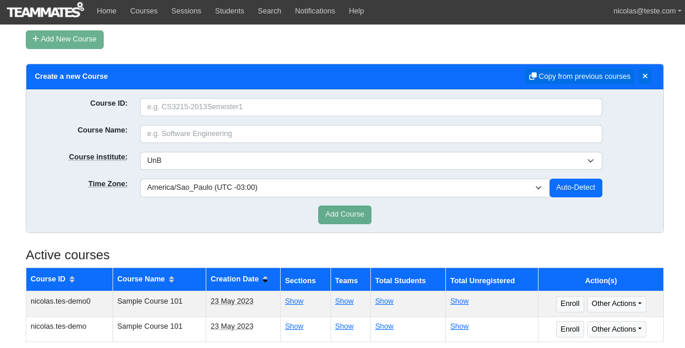
<fig> Tela de listagem de cursos, sem nenhum curso cadastrado além dos <i>default</i>.</fig>

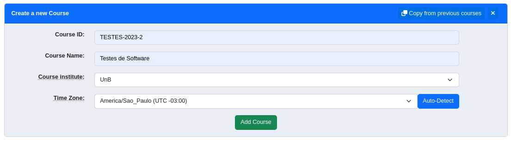
<fig> Tela criação de curso, com campos preenchidos.</fig>

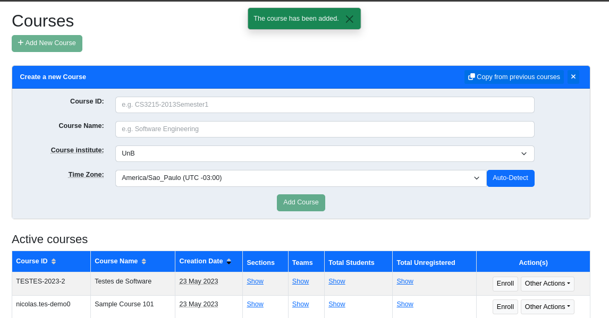
<fig>Mensagem de sucesso para curso criado.</fig>

## Condições de Entrada e de Saída

### Classes de Equivalência

A partir da especificação da funcionalidade foram identificadas as seguintes classes de equivalência.

<table>
<tr> <th>  <b> Variável  </b></th><th> Classes Válidas </th><th> Classes Inválidas </th></tr>
<tr> <td>  <b> Course ID  </b></td>
<td>

<v> Contém 1 ou mais letras</v>
<v> Contém 1 ou mais números</v>
<v> Contém 1 ou mais '.' (ponto final)</v>
<v> Contém 1 ou mais '-' (hífen)</v>
<v> Contém 1 ou mais '_' (underline)</v>
<v> Contém 1 ou mais '$' (cifrão)</v>
<v> 0 < tamanho < 65    </v>
<v> Contém 1 ou mais símbolos alfanuméricos </v>
<v> Não se repete </v>
</td>

<td>
<iv> tamanho = 0</iv>
<iv> tamanho >= 65</iv>
<iv> Contém 1 ou mais ' ' (espaços) </iv>
<iv> Não contém símbolos alfanuméricos </iv>
<iv> Se repete</iv>
</td>

</tr>
<tr> <td>  <b> Course name      </b></td>
<td>
<v> O primeiro caractere é alfanumérico</v>
<v> 0 < tamanho < 81 </v>
<v> Contém 1 ou mais caracteres especiais dentre:
'@', '#', '$', '&', '*', '(', ')', '+', '\', '/', '?', '!', '[', ']', '{', '}', '-', '_', 'ª', 'º', "'", '"'  </v>

</td>

<td>

<iv>Contém 1 ou mais '|' (barra vertical) </iv>
<iv>Contém 1 ou mais '%' (porcentagem) </iv>
<iv>tamanho = 0 </iv>
<iv>tamanho >= 81 </iv>
<iv>Primeiro caractere não alfanumérico</iv>
</td>

</tr>

<tr> <td>  <b> Course Institute </b></td>
<td>
<v> É uma instituição cadastrada no sistema </v>
<v> É uma das instituições do instrutor
</td>
<td>
<iv> É uma instituição não cadastrada no sistema </iv>
<iv> É uma instituição à qual o instrutor não pertence </iv>
</td>
</tr>
<tr> <td><b> Time Zone </b></td>
<td><v> É um fuso horário válido dentre os 24 existentes. </v></td>
<td><iv> Qualquer outro valor </iv></td>
</tr>
</table>

> Legenda:
>
> <v style="counter-reset:validClass invalidClass">numeração das classes válidas: </v> <iv style="counter-reset:equivalenceClass">numeração das classes inválidas: </iv>

### Análise de Valor Limite

A técnica de Análise de Valor Limite foi aplicada para determinar os limites válidos e inválidos para os intervalos numéricos, no caso o tamanho dos identificadores e nomes dos cursos.

| Variável | Limite Inferior Inválido | Limite Inferior Válido | Limite Superior Válido | Limite Superior Inválido |
| -------- | ------------------------ | ---------------------- | ---------------------- | ------------------------ |
| Course ID (tamanho) | 0 | 1 | 64 | 65 |
| Course name (tamanho) | 0 | 1 | 80 | 81 |

## Especificação dos Casos de Teste

Todos os casos de teste levam em consideração um instrutor cadastrado nas instituições 'UnB e FGA' com o curso com ID "TESTE" já cadastrado. No sistema está cadastrada, para outro instrutor, a instituição Anhanguera.

<table id="test-cases" style="counter-reset: validClass invalidClass">

<tr>
<th rowspan=2> Casos de Teste</th>
<th rowspan=2> Classes Contempladas </th>
<th colspan=4 style="text-align:center"> Dados de Entrada </th>
<th rowspan=2> Saída Esperada</th>
</tr>
<tr>

<th>Course ID</th>
<th>Course Name </th>
<th>Course Institute</th>
<th>Timezone</th>

</tr>

<tr>
<td> <tc> </tc> </td>
<td>

<v></v><v></v><v></v><v></v><v></v><v></v><v></v><v></v><v></v><v></v><v></v><v></v><v></v><v></v><v></v>
</td>
<td> Testes-De-Software_T02-2023-Universidade.De.Brasilia$2023--01-TM  (64 caracteres) </td>
<td> abcd efghijklm nopqrstuvwxy zABCDEFGHIJKLMNOPQRSTUVWXYZ@\#$&*()+\/?![]{}-_ ªº""''   (80 caracteres) </td>
<td> UnB </td>
<td> America/Sao_Paulo (UTC -3) </td>
<td> Curso criado. </td>
</tr>

<tr>
<td> <tc> </tc> </td>
<td> <iv ></iv> </td>
<td> (0 caracteres) </td>
<td> Curso de Teste </td>
<td> UnB </td>
<td> America/Sao_Paulo (UTC -3) </td>
<td> Curso <b>não</b> criado. </td>
</tr>
<tr>
<td> <tc> </tc> </td>
<td> <iv></iv> </td>
<td> Testes-De-Software_T02-2023-Universidade.De.Brasília$2023--01-TMS (65 caracteres) </td>
<td> Curso de Teste </td>
<td> UnB </td>
<td> America/Sao_Paulo (UTC -3) </td>
<td> Curso <b>não</b> criado. </td>
</tr>
<tr>
<td> <tc> </tc> </td>
<td> <iv ></iv> </td>
<td> Testes deSoftware</td>
<td> Curso de Teste </td>
<td> UnB </td>
<td> America/Sao_Paulo (UTC -3) </td>
<td> Curso <b>não</b> criado. </td>
</tr>

<tr>
<td> <tc> </tc> </td>
<td> <iv ></iv> </td>
<td> $_-. </td>
<td> Curso de Teste </td>
<td> UnB </td>
<td> America/Sao_Paulo (UTC -3) </td>
<td> Curso <b>não</b> criado. </td>
</tr>

<tr>
<td> <tc> </tc> </td>
<td> <iv ></iv> </td>
<td> TESTE </td>
<td> Curso de Teste </td>
<td> UnB </td>
<td> America/Sao_Paulo (UTC -3) </td>
<td> Curso <b>não</b> criado. </td>
</tr>

<tr>
<td> <tc> </tc> </td>
<td> <iv ></iv> </td>
<td> TestesDeSoftware </td>
<td> Curso d|e Teste </td>
<td> UnB </td>
<td> America/Sao_Paulo (UTC -3) </td>
<td> Curso <b>não</b> criado. </td>
</tr>

<tr>
<td> <tc> </tc> </td>
<td> <iv ></iv> </td>
<td> TestesDeSoftware </td>
<td> Curso d%e Teste </td>
<td> UnB </td>
<td> America/Sao_Paulo (UTC -3) </td>
<td> Curso <b>não</b> criado. </td>
</tr>

<tr>
<td> <tc> </tc> </td>
<td> <iv ></iv> </td>
<td> TestesDeSoftware </td>
<td> (0 caracteres) </td>
<td> UnB </td>
<td> America/Sao_Paulo (UTC -3) </td>
<td> Curso <b>não</b> criado. </td>
</tr>

<tr>
<td> <tc> </tc> </td>
<td> <iv ></iv> </td>
<td> TestesDeSoftware </td>
<td> abcd efghijklm nopqrstuvwxy zABCDEFGHIJKLMNOPQRSTUVWXYdZ@\#$&*()+\/?![]{}-_ ªº""''   (81 caracteres) </td>
<td> UnB </td>
<td> America/Sao_Paulo (UTC -3) </td>
<td> Curso <b>não</b> criado. </td>
</tr>

<tr>
<td> <tc> </tc> </td>
<td> <iv ></iv> </td>
<td> TestesDeSoftware </td>
<td> @Curso de Teste </td>
<td> UnB </td>
<td> America/Sao_Paulo (UTC -3) </td>
<td> Curso <b>não</b> criado. </td>
</tr>

<tr>
<td> <tc> </tc> </td>
<td> <iv ></iv> </td>
<td> TestesDeSoftware </td>
<td> Curso de Teste </td>
<td> Católica </td>
<td> America/Sao_Paulo (UTC -3) </td>
<td> Curso <b>não</b> criado. </td>
</tr>

<tr>
<td> <tc> </tc> </td>
<td> <iv ></iv> </td>
<td> TestesDeSoftware </td>
<td> Curso de Teste </td>
<td> FGA </td>
<td> America/Sao_Paulo (UTC -3) </td>
<td> Curso <b>não</b> criado. </td>
</tr>

<tr>
<td> <tc> </tc> </td>
<td> <iv ></iv> </td>
<td> TestesDeSoftware </td>
<td> Curso de Teste </td>
<td> UnB </td>
<td> X </td>
<td> Curso <b>não</b> criado. </td>
</tr>

</table>

## Execução dos Testes

### Configuração do Ambiente

Inicialmente foram criados dois instrutores, de forma a ter mais de uma instituição cadastrada, e um curso com ID "TESTE" para um deles.

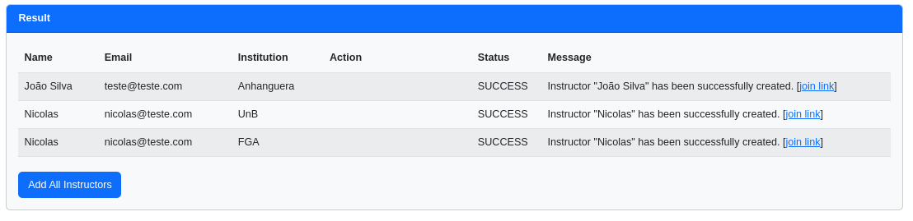

<fig>Instrutores criados.</fig>

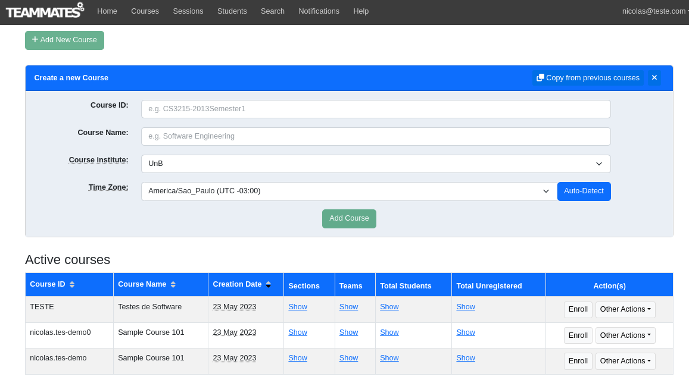
<fig>Curso TESTE criado.</fig>

### Testes Executados

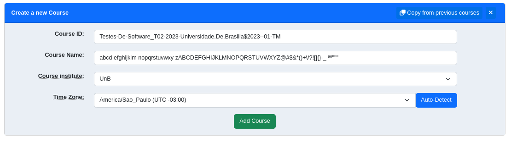
<fig>Dados preenchidos.</fig>

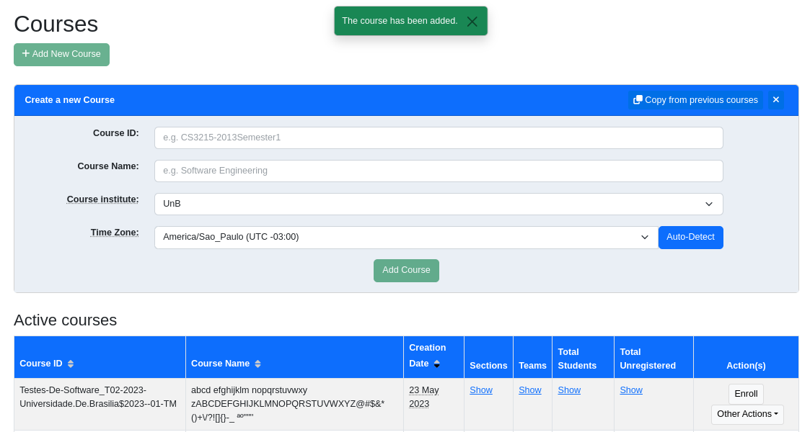
<fig>Mensagem de sucesso e curso listado.</fig>

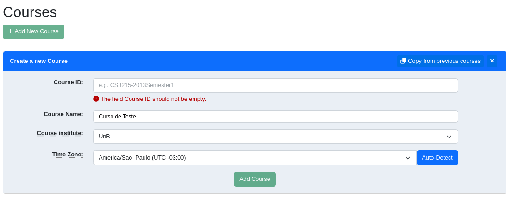
<fig>Captura de tela: <tce>.</fig>

> <h4 style="color:red"> A validação do frontend não permite textos maiores do que 64 caracteres.

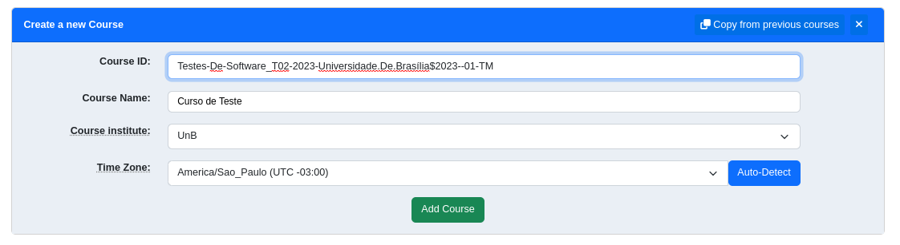
<fig>Captura de tela: <tce>.</fig>

<fig>Captura de tela: <tce>.</fig>

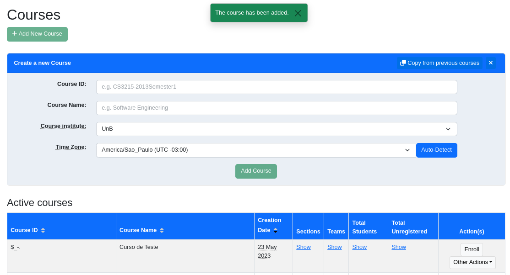
<fig>Captura de tela: <tce>.</fig>

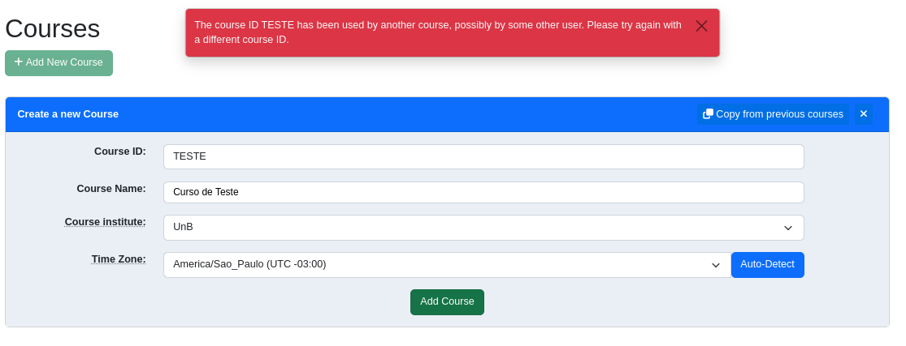
<fig>Captura de tela: <tce>.</fig>

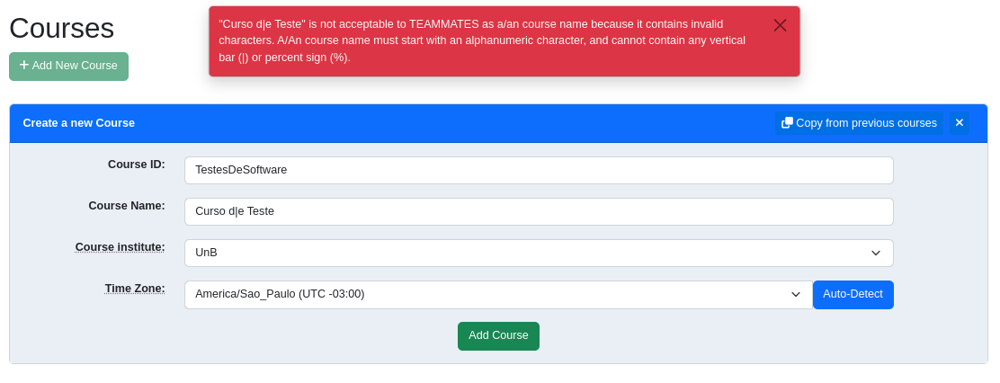
<fig>Captura de tela: <tce>.</fig>

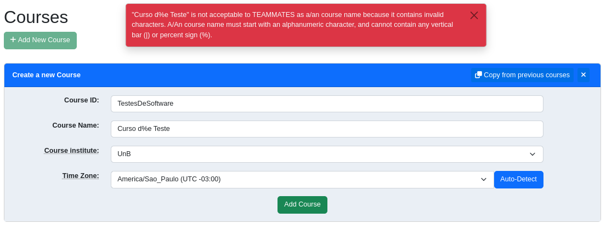
<fig>Captura de tela: <tce>.</fig>

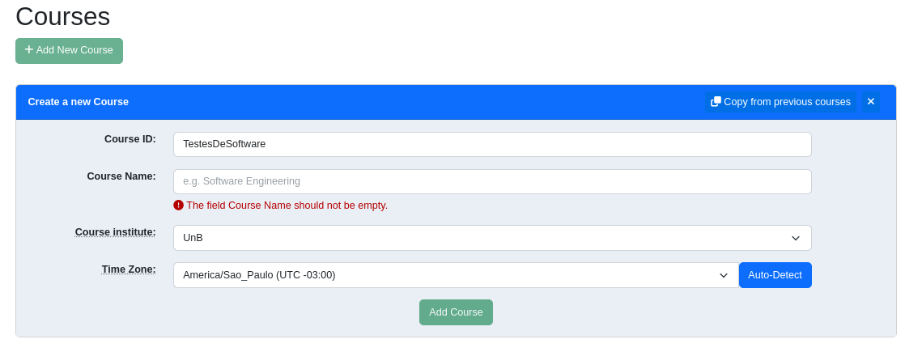
<fig>Captura de tela: <tce>.</fig>

> <h4 style="color:red"> A validação do frontend não permite textos maiores do que 81 caracteres.</h4>

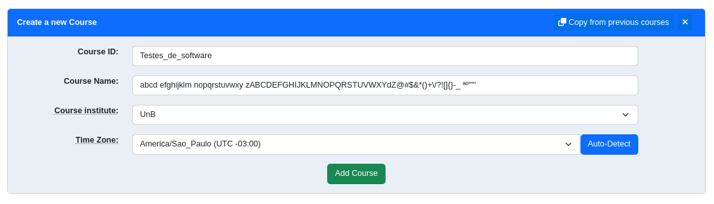
<fig>Captura de tela: <tce>.</fig>

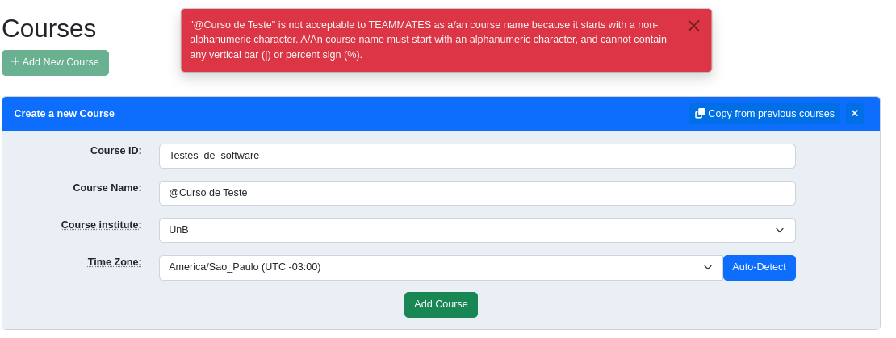
<fig>Captura de tela: <tce>.</fig>

> <h4 style="color:red"> A validação do frontend não permite a escolha de outras instituições.

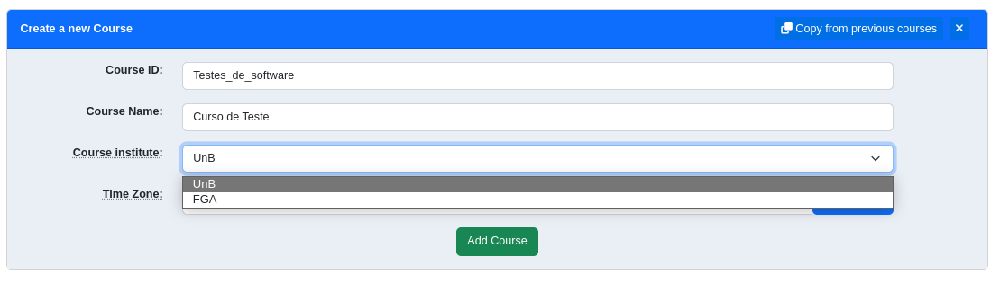
<fig>Captura de tela: <tce> e <tce>.</fig>

> <h4 style="color:red"> A validação do frontend não permite a escolha de outros fuso horários.

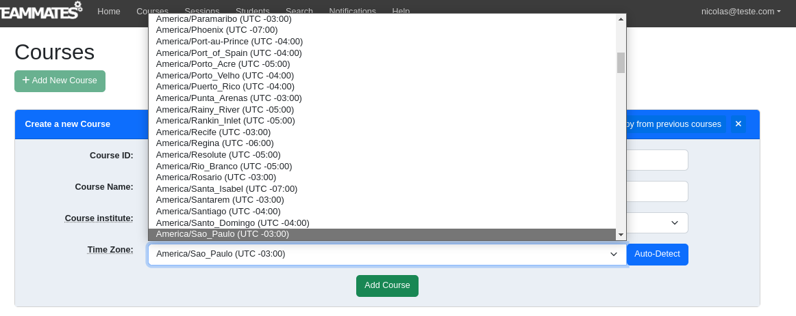
<fig>Captura de tela: <tce>.</fig>

## Resultados

| Caso de Teste | Resultado |
| ------------- | --------- |
| A |  **Sucesso** |
| B |  **Sucesso** |
| C |  **Sucesso** |
| D |  **Sucesso** |
| E |    **Falha**|
| F |  **Sucesso** |
| G |  **Sucesso** |
| H |  **Sucesso** |
| I |  **Sucesso** |
| J |  **Sucesso** |
| L |  **Sucesso** |
| M |  **Sucesso** |
| N |  **Sucesso** |

No caso de **teste E** esperava-se que o curso não fosse cadastrado, houve falha no teste já que o curso foi cadastrado.

### Resumo

| **Testes executados**| **Testes com sucesso**| **Taxa de sucesso**|
| - | - | - |
| 14 | 13 | 92,85% |

## Falhas Identificadas

Durante a execução dos testes a única falha encontrada foi **no caso de teste E**, quando foi permitido cadastrar um curso sem caracteres alfanuméricos em seu ID. Portanto, o resultado esperado foi encontrado em 13 dos 14 testes, um total de 92,85% dos testes. Durante a execução dos casos de teste também foi identificada uma funcionalidade ainda não presente no sistema, o cadastro de palavras acentuadas, mas levando em consideração que o idioma do sistema é inglês, essa funcionalidade não foi testada e não se mostra necessária.

## Conclusão

Os casos de teste apontaram que as validações para os valores inseridos no cadastro de um curso funcionam adequadamente. A documentação dos requisitos do sistema não é clara em relação aos domínios de valores aceitos, portanto para a derivação dos casos de uso foram levados em consideração as restrições expressas nas mensagens de erro e o senso comum.
