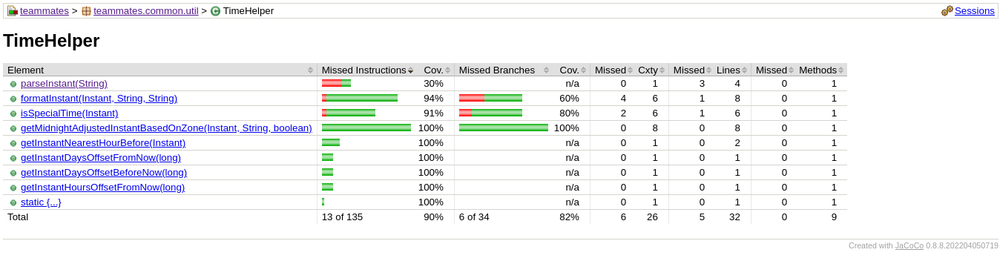
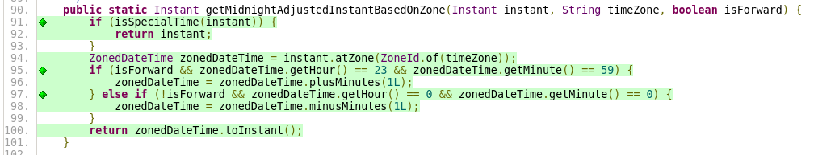
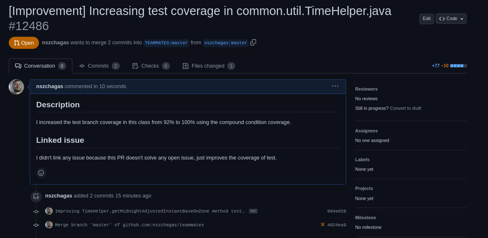

<style>

body {
    counter-reset: condicoes;
}

c:after {
    font-weight: bold;
    color: red;
    counter-increment: condicoes;
    white-space: pre;
    content: " (" counter(condicoes)")\a";
}

T:before {
    color: green;
    font-weight: bold;
    content: "T"
}

F:before {
    color: red;
    font-weight: bold;
    content: "F"
}

</style>


<hr>

<table class="cabecalho">
<tr><td colspan=2><b>FGA 0238 Testes de Software - Turma 02 </b></td><td> <b>Semestre</b>  </td><td> 2023.1 </td></tr>
<tr><td><b>Nome</b> </td><td> Nicolas Chagas Souza                </td><td> <b>Matrícula</b> </td><td> 20/0042327 </td></tr>
<tr><td><b>Equipe</b></td><td> PassaNada</td></tr>
</table>

<hr>
<center>

<b> Atividade 3 – Desenvolver Testes de Unidade </b>

</center>
<hr>

## Identificação do Projeto

A aplicação em teste é o TEAMMATES, que fornece funcionalidades para avaliação entre pares. Para utilizar o sistema, um instrutor deve solicitar uma conta na plataforma, em seguida, ele pode criar cursos, inscrever alunos nesses cursos, separados por grupos, e gerar sessões de avaliações por pares, onde cada integrante avalia a si mesmo e aos demais integrantes do grupo, por meio de questões definidas pelo instrutor.

O fork utilizado está disponível no [link](https://github.com/nszchagas/teammates).

## Cobertura de Testes

A execução dos testes de backend gerou o relatório representado nas figuras seguintes.

<center>


<fig>Relatório geral dos testes.</fig>
</center>

<center>


<fig>Relatório das classes do pacote util.</fig>
</center>

<center>


<fig>Relatório dos métodos da classe TimeHelper.</fig>
</center>

<center>


<fig>Cobertura do método testado antes da criação dos testes unitários.</fig>
</center>

## Método testado

O método escolhido para teste foi o `getMidnightAdjustedInstanteBaseOnZone` da classe `teammates.common.util.TimeHelper`.

```java title="teammates.common.util.TimeHelper.java" linenums="1"
/**
     * Gets an Instant which is adjusted for midnight time (23:59 and 00:00) at the specified time zone.
     * The direction of adjustment (23:59 to 00:00 or vice versa) is determined by {@code isForward} parameter.
*/
public static Instant getMidnightAdjustedInstantBasedOnZone(Instant instant, String timeZone, boolean isForward) {
        if (isSpecialTime(instant)) {
            return instant;
        }
        ZonedDateTime zonedDateTime = instant.atZone(ZoneId.of(timeZone));
        if (isForward && zonedDateTime.getHour() == 23 && zonedDateTime.getMinute() == 59) {
            zonedDateTime = zonedDateTime.plusMinutes(1L);
        } else if (!isForward && zonedDateTime.getHour() == 0 && zonedDateTime.getMinute() == 0) {
            zonedDateTime = zonedDateTime.minusMinutes(1L);
        }
        return zonedDateTime.toInstant();
    }

```

## Classe de Testes

Antes da incrementação dos testes existentes, o método de teste da classe estava no seguinte estado:

```java title="teammates.common.util.TimeHelperTest.java" linenums="1"
    @Test
    public void testGetMidnightAdjustedInstantBasedOnZone() {
        String zoneId = "UTC";
        Instant instantAt0000 = LocalDateTime.of(2015, Month.NOVEMBER, 30, 0, 0).atZone(ZoneId.of(zoneId)).toInstant();

        Instant backwardAdjusted = TimeHelper.getMidnightAdjustedInstantBasedOnZone(instantAt0000, zoneId, false);
        assertEquals("Sun, 29 Nov 2015, 11:59 PM UTC",
                TimeHelper.formatInstant(backwardAdjusted, zoneId, DATETIME_DISPLAY_FORMAT));

        Instant forwardAdjusted = TimeHelper.getMidnightAdjustedInstantBasedOnZone(instantAt0000, zoneId, true);
        assertEquals("Mon, 30 Nov 2015, 12:00 AM UTC",
                TimeHelper.formatInstant(forwardAdjusted, zoneId, DATETIME_DISPLAY_FORMAT));

        Instant instantAt2359 = LocalDateTime.of(2015, Month.NOVEMBER, 29, 23, 59).atZone(ZoneId.of(zoneId)).toInstant();

        backwardAdjusted = TimeHelper.getMidnightAdjustedInstantBasedOnZone(instantAt2359, zoneId, false);
        assertEquals("Sun, 29 Nov 2015, 11:59 PM UTC",
                TimeHelper.formatInstant(backwardAdjusted, zoneId, DATETIME_DISPLAY_FORMAT));

        forwardAdjusted = TimeHelper.getMidnightAdjustedInstantBasedOnZone(instantAt2359, zoneId, true);
        assertEquals("Mon, 30 Nov 2015, 12:00 AM UTC",
                TimeHelper.formatInstant(forwardAdjusted, zoneId, DATETIME_DISPLAY_FORMAT));

        String wrongTimeZone = "Asia/Singapore";

        backwardAdjusted = TimeHelper.getMidnightAdjustedInstantBasedOnZone(instantAt0000, wrongTimeZone, false);
        assertEquals("Mon, 30 Nov 2015, 12:00 AM UTC",
                TimeHelper.formatInstant(backwardAdjusted, zoneId, DATETIME_DISPLAY_FORMAT));

        forwardAdjusted = TimeHelper.getMidnightAdjustedInstantBasedOnZone(instantAt2359, wrongTimeZone, true);
        assertEquals("Sun, 29 Nov 2015, 11:59 PM UTC",
                TimeHelper.formatInstant(forwardAdjusted, zoneId, DATETIME_DISPLAY_FORMAT));
    }


```

## Tabela de decisões/condições

 |  Decisão  |  Situação para `true`  |  Situação para `false`  |
 |  -------  |  --------------------  |  ---------------------  |
 |  3  |  O `instant` é um entre:<br/> `Const.TIME_REPRESENTS_FOLLOW_OPENING`<br/>`Const.TIME_REPRESENTS_FOLLOW_VISIBLE`<br/>`Const.TIME_REPRESENTS_LATER`<br/>`Const.TIME_REPRESENTS_NOW`  |  O `instant` não é uma dessas constantes.  |
 |  7  |  A formatação do tempo é para frente (`isForward == true`) e o horário é 23:59  |  A formatação do tempo não é para frente (`isForward == false`) ou o horário é diferente de 23:59.  |
 |  9  |  A formatação do tempo não é para frente (`isForward == false`) e o horário é 00:00  |  A formatação do tempo é para frente (`isForward == true`) ou o horário é diferente de 00:00.

<tab> Identificação das decisões. </tab>

 | Decisão | Condição                          | Situação para `true`                                                                                                                                                                 | Situação para `false`                                           |
 | ------- | --------------------------------- | ------------------------------------------------------------------------------------------------------------------------------------------------------------------------------------ | --------------------------------------------------------------- |
 | 3       | `isSpecialTime(instant)`          | `instant` é um entre:<br/> `Const.TIME_REPRESENTS_FOLLOW_OPENING`<br/>`Const.TIME_REPRESENTS_FOLLOW_VISIBLE`<br/>`Const.TIME_REPRESENTS_LATER`<br/>`Const.TIME_REPRESENTS_NOW`  <c/> | `instant` é diferente desses.  <c/>                             |
 | 7A      | `isForward`                       | `isForward==true`  <c/>                                                                                                                                                              | `isForward==false`  <c/>                                        |
 | 7B      | `zonedDateTime.getHour() == 23`   | O `instant` está entre `23:00` e `23:59`.  <c/>                                                                                                                                      | O `instant` está fora do intervalo de `23:00` à `23:59`.  <c/ > |
 | 7C      | `zonedDateTime.getMinute() == 59` | O `instant` é do tipo `hh:59`, com hh entre 0 e 23.  <c/>                                                                                                                            | O `instant` é do tipo `hh:mm`, com `mm != 59`.  <c/ >           |
 | 9A      | `!isForward`                      | `isForward==false`  <c/>                                                                                                                                                             | `isForward==true`  <c/ >                                        |
 | 9B      | `zonedDateTime.getHour() == 0`    | O `instant` está entre `00:00` e `00:59`.  <c/>                                                                                                                                      | O `instant` está fora do intervalo de `00:00` à `00:59`.  <c/ > |
 | 9C      | `zonedDateTime.getMinute() == 0`  | O `instant` é do tipo `hh:00`, com hh entre 0 e 23.  <c/>                                                                                                                            | O `instant` é do tipo `hh:mm`, com `mm != 00`. <c/ >            |

<tab>Identificação das condições.</tab>

## Especificação dos Casos de Teste

A técnica das combinações múltiplas foi utilizadas para a determinação dos casos de teste, representados na tabela a seguir. Observe que 7A e 9A são opostas, então não é possível 7A == 9A. As condições 7B e 9B são incompatíveis, então não é possível ter 7B == 9B. As condições 7C e 9C são incompatíveis, então não é possível ter 7C == 9B. Como todas as constantes especiais de tempo possuem horário `00:00`, a condição 3 ser verdadeira implica em 9B e 9C verdadeiros e 7B e 7C falsos. Levando em consideração esses fatores, as combinações possíveis entre as decisões 7A, 7B e 7C e as decisões 9A, 9B e 9C foram representadas na tabela a seguir.

 | Número da combinação | 3    | 7A   | 7B   | 7C   | 9A   | 9B   | 9C   | Caso de Teste |
 | -------------------- | ---- | ---- | ---- | ---- | ---- | ---- | ---- | ------------- |
 | #1                   | X    | <F/> | <F/> | <F/> | <T/> | <T/> | <T/> | 3             |
 | #2                   | <F/> | <F/> | <F/> | <T/> | <T/> | <T/> | <F/> | 4             |
 | #3                   | <F/> | <F/> | <T/> | <F/> | <T/> | <F/> | <T/> | 5             |
 | #4                   | <F/> | <F/> | <T/> | <T/> | <T/> | <F/> | <F/> | 2             |
 | #5                   | X    | <T/> | <F/> | <F/> | <F/> | <T/> | <T/> | 1             |
 | #6                   | <F/> | <T/> | <F/> | <T/> | <F/> | <T/> | <F/> | 6             |
 | #7                   | <F/> | <T/> | <T/> | <F/> | <F/> | <F/> | <T/> | 7             |
 | #8                   | <F/> | <T/> | <T/> | <T/> | <F/> | <F/> | <F/> | 8             |

<tab> Combinações entre as condições. </tab>

> X denota o 'don't care'.

<table>

<tr>
<td rowspan="2" class="header"> Número </td>
<td rowspan="2" class="header"> Condições  </td>
<td colspan="3" class="header"> Condição de Entrada </td>
<td  class="header"> Combinações  </td>
<td rowspan="2" class="header"> Saída Esperada  </td>
</tr>

<tr>

<td><code>instant</code></td>
<td><code>timeZone</code></td>
<td><code>isForward</code></td>
<td class="header"> | 3 | 7A | 7B | 7C | 9A | 9B | 9C | </td>
</tr>

<tr>
<td>1</td>
<td>1, 3, 6, 8, 10, 11, 13 </td>
<td><code>TIME_REPRESENTS_FOLLOW_OPENING¹</code></td>
<td>GMT-3</td>
<td>true</td>
<td> | <T/>  | <T/>  | <F/>  | <F/>  | <F/>  | <T/>  | <T/>  | </td>
<td>TIME_REPRESENTES_FOLLOW_OPENING</td>
</tr>

<tr>
<td>2</td>
<td>2, 4, 5, 7, 9, 12, 14</td>
<td>2023-05-31 23:59:00</td>
<td>GMT-3</td>
<td>false</td>
<td> | <F/> | <F/> | <T/> | <T/> | <T/> | <F/> | <F/> |</td>
<td>2023-05-31 23:59:00</td>
</tr>

<tr>
<td>3</td>
<td>-</td>
<td>2023-05-31 00:00:00</td>
<td>GMT-3</td>
<td>false</td>
<td>| <F/> | <F/> | <F/> | <F/> | <T/> | <T/> | <T/> |</td>
<td>2023-05-30 23:59:00</td>
</tr>

<tr>
<td>4</td>
<td>-</td>
<td>2023-05-31 00:59:00</td>
<td>GMT-3</td>
<td>false</td>
<td>| <F/> | <F/> | <F/> | <T/> | <T/> | <T/> | <F/> |</td>

<td>2023-05-31 00:59:00</td>
</tr>

<tr>
<td>5</td>
<td>-</td>
<td>2023-05-31 23:00:00</td>
<td>GMT-3</td>
<td>false</td>

<td>| <F/> | <F/> | <T/> | <F/> | <T/> | <F/> | <T/> |</td>

<td>2023-05-31 23:00:00</td>
</tr>

<tr>
<td>6</td>
<td>-</td>
<td>2023-05-31 00:59:00</td>
<td>GMT-3</td>
<td>true</td>

<td>| <F/> | <T/> | <F/> | <T/> | <F/> | <T/> | <F/> |</td>

<td>2023-05-31 00:59:00</td>
</tr>

<tr>
<td>7</td>
<td>-</td>
<td>2023-05-31 23:00:00</td>
<td>GMT-3</td>
<td>true</td>

<td>| <F/> | <T/> | <T/> | <F/> | <F/> | <F/> | <T/>| </td>

<td>2023-05-31 23:00:00</td>
</tr>

<tr>
<td>8</td>
<td>-</td>
<td>2023-05-31 23:59:00</td>
<td>GMT-3</td>
<td>true</td>

<td>| <F/> |  <T/> |  <T/> |  <T/> |  <F/> |  <F/> |  <F/> |</td>

<td>2023-06-01 00:00:00</td>
</tr>

</table>

> ¹`Const.TIME_REPRESENTS_FOLLOW_OPENING = TimeHelper.parseInstant("1970-12-31 00:00:00Z")` como o horário dessa constante é 0:00, ela já satisfaz as condições 11 e 13.

## Implementação dos Casos de Teste

```java title="TimeHelperTest.java" linenums="1"
--8<--
toss3/TimeHelperTest.java:method_test
--8<--
```

## Análise e Resultados

Após a execução dos testes da classe TimeHelperTest.java o seguinte resultado foi obtido na console.

```text

> Task :compileJava UP-TO-DATE
> Task :processResources UP-TO-DATE
> Task :classes UP-TO-DATE
> Task :compileTestJava UP-TO-DATE
> Task :processTestResources UP-TO-DATE
> Task :testClasses UP-TO-DATE
> Task :componentTests
Jun 19, 2023 7:53:04 PM teammates.common.util.Logger info
INFO: teammates.logic.core.LogicStarter:initializeDependencies:43: Initialized dependencies between logic classes
[=============================teammates.common.util.TimeHelperTest=============================]
teammates.common.util.TimeHelperTest completed
Jun 19, 2023 7:53:04 PM com.google.cloud.testing.BlockingProcessStreamReader writeLog
INFO: [datastore] Adding handler(s) to newly registered Channel.
component-tests > component-tests > teammates.common.util.TimeHelperTest > testEndOfYearDates PASSED
component-tests > component-tests > teammates.common.util.TimeHelperTest > testFormatDateTimeForDisplay PASSED
component-tests > component-tests > teammates.common.util.TimeHelperTest > testGetInstantDaysOffsetBeforeNow PASSED
component-tests > component-tests > teammates.common.util.TimeHelperTest > testGetInstantDaysOffsetFromNow PASSED
component-tests > component-tests > teammates.common.util.TimeHelperTest > testGetInstantHoursOffsetFromNow PASSED
component-tests > component-tests > teammates.common.util.TimeHelperTest > testGetInstantNearestHourBefore PASSED
component-tests > component-tests > teammates.common.util.TimeHelperTest > testGetMidnightAdjustedInstantBasedOnZone PASSED
component-tests > component-tests > teammates.common.util.TimeHelperTest > 
testGetMidnightAdjustedInstantBasedOnZoneWithProjectsTimeConstantShouldReturnSameConstant PASSED
component-tests > component-tests > teammates.common.util.TimeHelperTest > 
testGetMidnightAdjustedInstantBasedOnZoneWithTime0000notForwardShouldReturnPreviousDayAt2359 PASSED
component-tests > component-tests > teammates.common.util.TimeHelperTest > 
testGetMidnightAdjustedInstantBasedOnZoneWithTime0059andForwardShouldReturnSameInstant PASSED
component-tests > component-tests > teammates.common.util.TimeHelperTest > 
testGetMidnightAdjustedInstantBasedOnZoneWithTime0059notForwardShouldReturnSameInstant PASSED
component-tests > component-tests > teammates.common.util.TimeHelperTest > 
testGetMidnightAdjustedInstantBasedOnZoneWithTime2300andForwardShouldReturnSameInstant PASSED
component-tests > component-tests > teammates.common.util.TimeHelperTest > 
testGetMidnightAdjustedInstantBasedOnZoneWithTime2300notForwardShouldReturnSameInstant PASSED
component-tests > component-tests > teammates.common.util.TimeHelperTest > 
testGetMidnightAdjustedInstantBasedOnZoneWithTime2359andForwardShouldReturnNextDayAt0000 PASSED
component-tests > component-tests > teammates.common.util.TimeHelperTest > 
testGetMidnightAdjustedInstantBasedOnZoneWithTime2359notForwardFalseShouldReturnSameInstant PASSED

```

Nenhuma falha foi identificada na funcionalidade por meio dos testes realizados, uma vez que todos passaram com sucesso. A criação dos testes aumentou a cobertura de testes do método, conforme ilustrado na figura a seguir.

<center>


<fig>Cobertura de testes depois da adição dos novos testes.</fig>
</center>

<center>


<fig>Cobertura de testes depois da adição dos novos testes.</fig>
</center>

## Pull Request

<center>


<fig>Screenshot do Pull Request.</fig>
</center>

## Links

 |  Descrição                 |  URL                                                                                                           |
 |  ------------------------  |  ------------------------------------------------------------------------------------------------------------  |
 |  Fork do projeto           |  <https://github.com/nszchagas/teammates>                                                                      |
 |  Implementação no projeto  |  <https://github.com/nszchagas/teammates/blob/master/src/test/java/teammates/common/util/TimeHelperTest.java>  |
 |  Commit da implementação   |  <https://github.com/nszchagas/teammates/commit/994a659202bcf2e25adad1450b5a0658eada7510>                      |
 |  Pull Request              |  <https://github.com/TEAMMATES/teammates/pull/12486>                                                           |
 |                            |                                                                                                                |
