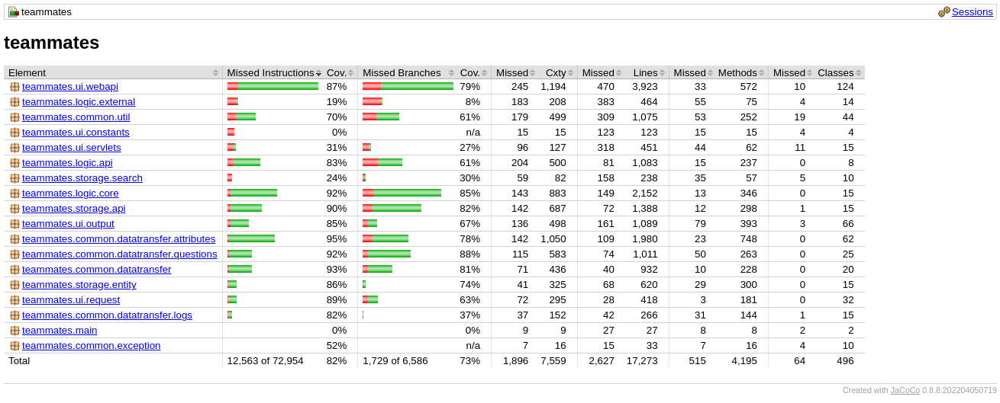
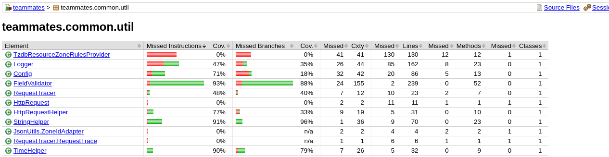
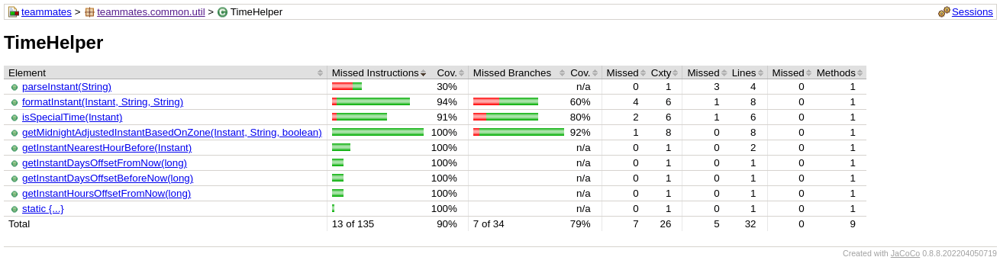
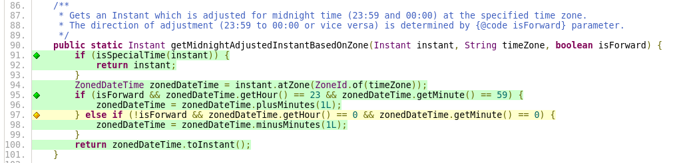

<style>
hr {
    border-top: 3px solid black;
}

.cabecalho {
 width: 100%
}

c:after {
    font-weight: bold;
    color: red;
    counter-increment:condicoes;
    white-space: pre;
    content:" (" counter(condicoes)")\a";
}

fig, tab {
    padding: 0;
    margin: 0;
    display: flex;
    justify-content: center;
}

fig:before{
    counter-increment:figuras;
    white-space: pre;
    content:"Figura " counter(figuras) ". ";
}

tab:before{
    counter-increment:tables;
    white-space: pre;
    content:"Tabela " counter(tables) ". ";
}

fig:after, tab:after {
    white-space: pre;

    content: " (Fonte: elaborado pelo autor, 2023)";
}

body {counter-reset:section condicoes figuras tables ;}

h2 {counter-reset:subsection figure;}

h2:before{
    counter-increment:section;
    content:counter(section) ". ";
}

h3:before{
    counter-increment:subsection;
    content:counter(section) "." counter(subsection) " ";
}

img {
    max-width: 100%
}

td, th {
   vertical-align: middle !important;
}

</style>


<hr>

<table class="cabecalho">
<tr><td colspan=2><b>FGA 0238 Testes de Software - Turma 02 </b></td><td> <b>Semestre</b>  </td><td> 2023.1 </td></tr>
<tr><td><b>Nome</b> </td><td> Nicolas Chagas Souza                </td><td> <b>Matrícula</b> </td><td> 20/0042327 </td></tr>
<tr><td><b>Equipe</b></td><td> PassaNada</td></tr>
</table>

<hr>
<center>

<b> Atividade 3 – Desenvolver Testes de Unidade </b>

</center>
<hr>

## Identificação do Projeto

A aplicação em teste é o TEAMMATES, que fornece funcionalidades para avaliação entre pares. Para utilizar o sistema, um instrutor deve solicitar uma conta na plataforma, em seguida, ele pode criar cursos, inscrever alunos nesses cursos, separados por grupos, e gerar sessões de avaliações por pares, onde cada integrante avalia a si mesmo e aos demais integrantes do grupo, por meio de questões definidas pelo instrutor.

O fork utilizado está disponível no [link](https://github.com/nszchagas/teammates).

## Cobertura de Testes

A execução dos testes de backend gerou o relatório representado nas figuras seguintes.

<center>


<fig>Relatório geral dos testes.</fig>
</center>

<center>


<fig>Relatório das classes do pacote util.</fig>
</center>

<center>


<fig>Relatório dos métodos da classe TimeHelper.</fig>
</center>

<center>


<fig>Cobertura do método testado antes da criação dos testes unitários.</fig>
</center>

## Método testado

O método escolhido para teste foi o `getMidnightAdjustedInstanteBaseOnZone` da classe `teammates.common.util.TimeHelper`.

```java title="teammates.common.util.TimeHelper.java" linenums="1"
/**
     * Gets an Instant which is adjusted for midnight time (23:59 and 00:00) at the specified time zone.
     * The direction of adjustment (23:59 to 00:00 or vice versa) is determined by {@code isForward} parameter.
*/
public static Instant getMidnightAdjustedInstantBasedOnZone(Instant instant, String timeZone, boolean isForward) {
        if (isSpecialTime(instant)) {
            return instant;
        }
        ZonedDateTime zonedDateTime = instant.atZone(ZoneId.of(timeZone));
        if (isForward && zonedDateTime.getHour() == 23 && zonedDateTime.getMinute() == 59) {
            zonedDateTime = zonedDateTime.plusMinutes(1L);
        } else if (!isForward && zonedDateTime.getHour() == 0 && zonedDateTime.getMinute() == 0) {
            zonedDateTime = zonedDateTime.minusMinutes(1L);
        }
        return zonedDateTime.toInstant();
    }

```

## Classe de Testes

Antes da incrementação dos testes existentes, o método de teste da classe estava no seguinte estado:

```java title="teammates.common.util.TimeHelperTest.java" linenums="1"
    @Test
    public void testGetMidnightAdjustedInstantBasedOnZone() {
        String zoneId = "UTC";
        Instant instantAt0000 = LocalDateTime.of(2015, Month.NOVEMBER, 30, 0, 0).atZone(ZoneId.of(zoneId)).toInstant();

        Instant backwardAdjusted = TimeHelper.getMidnightAdjustedInstantBasedOnZone(instantAt0000, zoneId, false);
        assertEquals("Sun, 29 Nov 2015, 11:59 PM UTC",
                TimeHelper.formatInstant(backwardAdjusted, zoneId, DATETIME_DISPLAY_FORMAT));

        Instant forwardAdjusted = TimeHelper.getMidnightAdjustedInstantBasedOnZone(instantAt0000, zoneId, true);
        assertEquals("Mon, 30 Nov 2015, 12:00 AM UTC",
                TimeHelper.formatInstant(forwardAdjusted, zoneId, DATETIME_DISPLAY_FORMAT));

        Instant instantAt2359 = LocalDateTime.of(2015, Month.NOVEMBER, 29, 23, 59).atZone(ZoneId.of(zoneId)).toInstant();

        backwardAdjusted = TimeHelper.getMidnightAdjustedInstantBasedOnZone(instantAt2359, zoneId, false);
        assertEquals("Sun, 29 Nov 2015, 11:59 PM UTC",
                TimeHelper.formatInstant(backwardAdjusted, zoneId, DATETIME_DISPLAY_FORMAT));

        forwardAdjusted = TimeHelper.getMidnightAdjustedInstantBasedOnZone(instantAt2359, zoneId, true);
        assertEquals("Mon, 30 Nov 2015, 12:00 AM UTC",
                TimeHelper.formatInstant(forwardAdjusted, zoneId, DATETIME_DISPLAY_FORMAT));

        String wrongTimeZone = "Asia/Singapore";

        backwardAdjusted = TimeHelper.getMidnightAdjustedInstantBasedOnZone(instantAt0000, wrongTimeZone, false);
        assertEquals("Mon, 30 Nov 2015, 12:00 AM UTC",
                TimeHelper.formatInstant(backwardAdjusted, zoneId, DATETIME_DISPLAY_FORMAT));

        forwardAdjusted = TimeHelper.getMidnightAdjustedInstantBasedOnZone(instantAt2359, wrongTimeZone, true);
        assertEquals("Sun, 29 Nov 2015, 11:59 PM UTC",
                TimeHelper.formatInstant(forwardAdjusted, zoneId, DATETIME_DISPLAY_FORMAT));
    }


```

## Tabela de decisões/condições

```java title="teammates.common.util.TimeHelper.java" linenums="1"
public static Instant getMidnightAdjustedInstantBasedOnZone(Instant instant, String timeZone, boolean isForward) {

        if (isSpecialTime(instant)) { // isSpecialTime determina se o parâmetro instant é uma destas constantes: Const.TIME_REPRESENTS_FOLLOW_OPENING; Const.TIME_REPRESENTS_FOLLOW_VISIBLE; Const.TIME_REPRESENTS_LATER; Const.TIME_REPRESENTS_NOW;         
            return instant;
        }
        ZonedDateTime zonedDateTime = instant.atZone(ZoneId.of(timeZone));
        if (isForward && zonedDateTime.getHour() == 23 && zonedDateTime.getMinute() == 59) {
            zonedDateTime = zonedDateTime.plusMinutes(1L);
        } else if (!isForward && zonedDateTime.getHour() == 0 && zonedDateTime.getMinute() == 0) {
            zonedDateTime = zonedDateTime.minusMinutes(1L);
        }
        return zonedDateTime.toInstant();
    }

```

| Decisão | Situação para `true` | Situação para `false` |
| ------- | -------------------- | --------------------- |
| 3 | O `instant` é um entre:<br/> `Const.TIME_REPRESENTS_FOLLOW_OPENING`<br/>`Const.TIME_REPRESENTS_FOLLOW_VISIBLE`<br/>`Const.TIME_REPRESENTS_LATER`<br/>`Const.TIME_REPRESENTS_NOW` | O `instant` não é uma dessas constantes. |
| 7 | A formatação do tempo é para frente (`isForward == true`) e o horário é 23:59 | A formatação do tempo não é para frente (`isForward == false`) ou o horário é diferente de 23:59. |
| 9 | A formatação do tempo não é para frente (`isForward == false`) e o horário é 00:00 | A formatação do tempo é para frente (`isForward == true`) ou o horário é diferente de 00:00.

<tab> Identificação das decisões. </tab>

| Decisão | Condição | Situação para `true` | Situação para `false` |
| ------- | -------- | -------------------- | --------------------- |
| 3  | `isSpecialTime(instant)` | `instant` é um entre:<br/> `Const.TIME_REPRESENTS_FOLLOW_OPENING`<br/>`Const.TIME_REPRESENTS_FOLLOW_VISIBLE`<br/>`Const.TIME_REPRESENTS_LATER`<br/>`Const.TIME_REPRESENTS_NOW`  <c/> | `instant` é diferente desses.  <c/> |
| 7A |  `isForward` | `isForward==true`  <c/> | `isForward==false`  <c/> |
| 7B | `zonedDateTime.getHour() == 23` | O `instant` está entre `23:00` e `23:59`.  <c/>| O `instant` está fora do intervalo de `23:00` à `23:59`.  <c/>|
| 7C | `zonedDateTime.getMinute() == 59` | O `instant` é do tipo `hh:59`, com hh entre 0 e 23.  <c/>| O `instant` é do tipo `hh:mm`, com `mm != 59`.  <c/>|
| 9A | `!isForward` | `isForward==false`  <c/>| `isForward==true`  <c/>|
| 9B | `zonedDateTime.getHour() == 0` | O `instant` está entre `00:00` e `00:59`.  <c/>| O `instant` está fora do intervalo de `00:00` à `00:59`.  <c/>|
| 9C | `zonedDateTime.getMinute() == 0` |  O `instant` é do tipo `hh:00`, com hh entre 0 e 23.  <c/>| O `instant` é do tipo `hh:mm`, com `mm != 00`. <c/>|

<tab>Identificação das condições.</tab>

## Especificação dos Casos de Teste

| Número | Condições | Combinações | `instant` | `timeZone` | `isForward` | Saída Esperada |
| ------ | --------- | ----------- | --------- | ---------- | ----------- | -------------- |
| 1      |

## Implementação dos Casos de Teste

## Análise e Resultados

## Pull Request

## Links

Fork do projeto: @TODO: inserir link
Implementação no projeto: @TODO: inserir link
Commit da implementação: @TODO: inserir link
Pull Request: @TODO: inserir link
