<hr>

<table class="cabecalho">
<tr><td colspan=2><b>FGA 0238 Testes de Software - Turma 02 </b></td><td> <b>Semestre</b>  </td><td> 2023.1 </td></tr>
<tr><td><b>Nome</b> </td><td> Nicolas Chagas Souza                </td><td> <b>Matrícula</b> </td><td> 20/0042327 </td></tr>
<tr><td><b>Equipe</b></td><td> PassaNada</td></tr>
</table>

<hr>
<p style="text-align: center"><b> Atividade 4 – TDD </b></p>
<hr>

## Funcionalidade

### Identificação da Issue

Devido a dificuldade de encontrar issues com funcionalidades compatíveis com o TDD, uma vez que a maioria das issues se refere à ajustes em componentes visuais e os testes em tais componentes são de complexa implementação devido à utilização de mocks no frontend, optou-se pela elaboração de uma nova funcionalidade não registrada em issue.

### Especificação

Deve ser possível importar dados da plataforma no formato JSON.

Critérios de aceitação:

- Enumeradores (enums) devem ser convertidos para string na conversão.
- A conversão deve ser recursiva, transformando em JSON objetos aninhados.
- Um array de objetos deve ser convertido para um array com objetos JSON.

## Execução

### Primeiro Ciclo

Durante o primeiro ciclo de desenvolvimento um objeto do tipo `Student`, cuja especificação está disponível na classe `api-output.ts`, será convertido para JSON.

```ts title="api-output.ts" linenums="1"
export interface ApiOutput {
  requestId?: string;
}

export interface Student extends ApiOutput {
  email: string;
  courseId: string;
  name: string;
  sectionName: string;
  teamName: string;
  googleId?: string;
  comments?: string;
  key?: string;
  institute?: string;
  joinState?: JoinState;
}
```

Por motivos didáticos, a conversão para JSON será feita sem a utilização de bibliotecas e funções próprias, mas para facilitar a verificação serão utilizados os métodos do objeto JSON do typescript.

#### Teste - Red State

Após a escrita do primeiro teste, a o arquivo de teste encontrava-se da seguinte maneira:

```ts title="json-helper.spec.ts" linenums="1"
--8<--
import {JsonHelper} from './json-helper'
import {Student} from '../types/api-output';

describe("JsonHelper", () => {

    it("Should parse student to JSON", () => {
        const input: Student = {
            name: "John Doe",
            courseId: "TESTES",
            email: "email@test.com.zt",
            teamName: "PassaNada",
            sectionName: "T01"
        };
        expect(JsonHelper.parseObjectToJSON(input)).toEqual(JSON.stringify(input))
    })
})
--8<--
```

Para que o teste fosse executado, foi necessário criar uma implementação mínima, obedecendo as regras de compilação do projeto, que exige que as funções declaradas sejam utilizadas assim como os parâmetros da função.

```ts title="json-helper.ts" linenums="1"
export class JsonHelper {
    public static parseObjectToJSON(object: Object): string {
        return object as string
    }
}
```

A primeira execução do teste aponta corretamente o red state, demonstrando que o método testado ainda não está implementado da maneira correta.

<center>
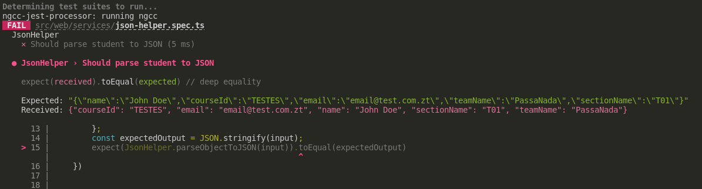

<fig>Primeira execução do teste criado.</fig>
</center>

#### Implementação do Código

Em seguida, o método `parseObjectToJSON` foi implementado da seguinte maneira:

```ts title="json-helper.ts" linenums="1"
public static parseObjectToJSON(object: Object): string {
    let jsonResponse = "{"
    const entries = Object.entries(object)
    for (const entry of entries) {
        const [key, value] = entry
        jsonResponse += `"${key}":"${value}"`;
        if (entries.indexOf(entry) != entries.length - 1)
            jsonResponse += ","
    }
    jsonResponse += "}"
    return jsonResponse
}
```

#### Teste - Green State

E então foi atingido o green state, com o sucesso ao rodar os testes:

<center>
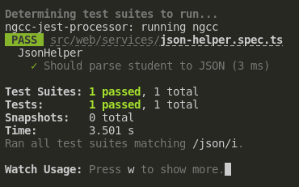
<fig>Confirmação do green state.</fig>
</center>

#### Refatoração

Não foi identificada necessidade de refatoração no método, apenas no código de teste, passando-o para a seguinte versão:

```ts title="json-helper.spec.ts" linenums="1"
 it("Should parse student to JSON", () => {
        const input: Student = {
            name: "John Doe",
            courseId: "TESTES",
            email: "email@test.com.zt",
            teamName: "PassaNada",
            sectionName: "T01"
        };
        expect(JsonHelper.parseObjectToJSON(input)).toEqual(JSON.stringify(input))
    })
```

### Segundo Ciclo

Durante o segundo ciclo, um objeto genérico foi escolhido para o tratamento de valores `null`, que os valores nulos devem aparecer como `null` no JSON.

#### Teste - Red State

Foram elaborados dois testes para contemplar as duas situações.

```ts title="json-helper.spec.ts" linenums="1"
    it("Should parse null values as null", () => {
        const input: Object = {
            name: "John Doe",
            email: null,
        }
        expect(JsonHelper.parseObjectToJSON(input)).toEqual(JSON.stringify(input))
    })
```

Como esperado, a execução deste teste ocasiona o red state:

<center>
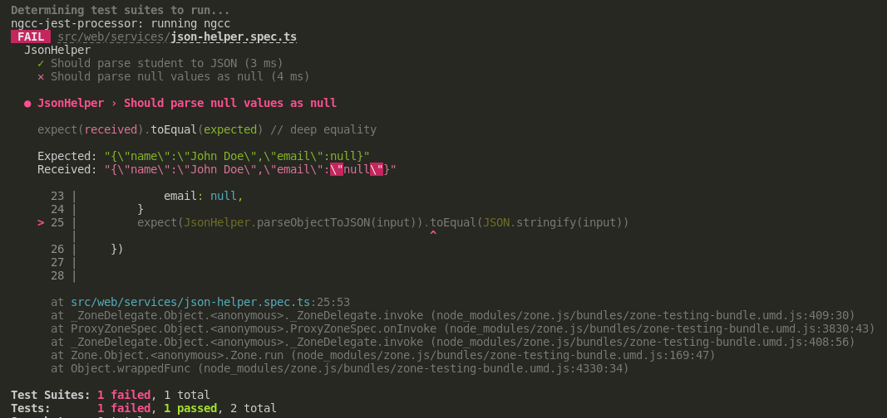
<fig>Falha no teste.</fig>
</center>

#### Implementação do Código

```ts title="json-helper.ts" linenums="1"
    public static parseObjectToJSON(object: Object): string {
        let jsonResponse = "{"
        const entries = Object.entries(object)
        for (const entry of entries) {
            const [key, value] = entry
            jsonResponse += `"${key}":`;
            if (!value)
                jsonResponse += `null`
            else
                jsonResponse += `"${value}"`
            if (entries.indexOf(entry) != entries.length - 1)
                jsonResponse += ","
        }
        jsonResponse += "}"
        return jsonResponse
    }
```

#### Teste - Green State

<center>
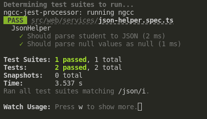
<fig></fig>
</center>

#### Refatoração

Não foi identificada necessidade de refatoração nesse ciclo.

### Terceiro Ciclo

Durante o terceiro ciclo, um objeto genérico foi escolhido para o tratamento de valores `undefined`, que não devem aparecer no JSON.

#### Teste - Red State

```ts title="json-helper.spec.ts" linenums="1"
it("Shouldn't contain undefined values", () => {
        const input: Object = {
            name: "John Doe",
            age: undefined
        }
        expect(JsonHelper.parseObjectToJSON(input)).toEqual(JSON.stringify(input))
    })
```

<center>
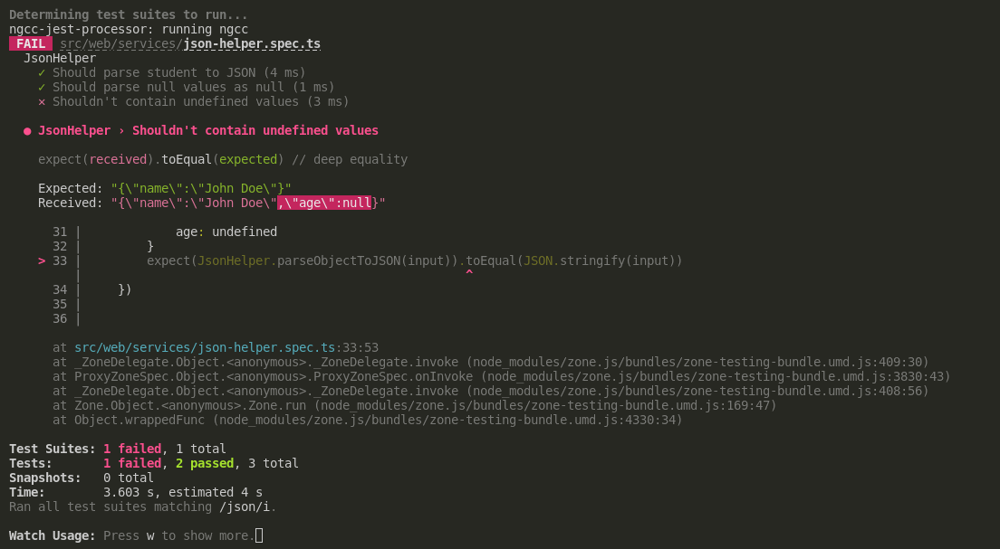
<fig>Indicação do RED State.</fig>
</center>

#### Implementação do Código

```ts title="json-helper.ts" linenums="1"
    public static parseObjectToJSON(object: Object): string {
        let jsonResponse = "{"
        const entries = Object.entries(object).filter(entry => entry[1] !== undefined)
        for (const entry of entries) {
            const [key, value] = entry
            jsonResponse += `"${key}":`;
            if (!value)
                jsonResponse += `null`
            else
                jsonResponse += `"${value}"`
            if (entries.indexOf(entry) != entries.length - 1)
                jsonResponse += ","
        }
        jsonResponse += "}"
        return jsonResponse
```

#### Teste - Green State

<center>
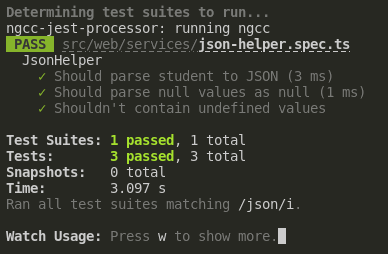
<fig>Green state.</fig>
</center>

#### Refatoração

Uma pequena mudança foi realizada durante a refatoração.

```ts title="json-helper.ts" linenums="1"

 public static parseObjectToJSON(object: Object): string {
        let jsonResponse = "{"

        const entries = Object.entries(object).filter(entry => entry[1] !== undefined)
        for (const entry of entries) {
            const [key, value] = entry
            jsonResponse += `"${key}":`;
            if (!value)
                jsonResponse += value
            else
                jsonResponse += `"${value}"`
            if (entries.indexOf(entry) != entries.length - 1)
                jsonResponse += ","
        }
        jsonResponse += "}"
        return jsonResponse
    }

```

Validada pela execução correta dos testes.

<center>
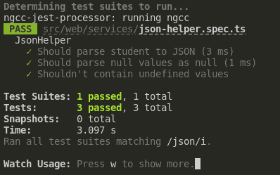
<fig>Testes em green state.</fig>
</center>

### Quarto Ciclo

Durante o quarto ciclo será feito o tratamento de números, que não devem ser rodeados por aspas em JSON.

#### Teste - Red State

Foram escritos três testes, para tratar números que são nativamente do tipo `number` e números em string.

```ts title="json-helper.spec.ts" linenums="1"
    it("Shouldn't quote numberic values", () => {
        const input: Object = {
            name: "John Doe",
            age: 25
        };
        expect(JsonHelper.parseObjectToJSON(input)).toEqual(JSON.stringify(input))
    })
    it("Shouldn't quote float values", () => {
        const input: Object = {
            name: "John Doe",
            score: 50.2
        };
        expect(JsonHelper.parseObjectToJSON(input)).toEqual(JSON.stringify(input))
    })
    it("Should quote string numbers", () => {
        const input: Object = {
            name: "John Doe",
            age: "25"
        };
        expect(JsonHelper.parseObjectToJSON(input)).toEqual(JSON.stringify(input))
    })
```

A execução destes testes indicou que a última opção já está contemplada no código.

<center>
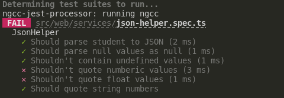
<fig>Indicação do RED State.</fig>
</center>

#### Implementação do Código

```ts title="json-helper.ts" linenums="1"
 public static parseObjectToJSON(object: Object): string {
        let jsonResponse = "{"

        const entries = Object.entries(object).filter(entry => entry[1] !== undefined)
        for (const entry of entries) {
            const [key, value] = entry
            jsonResponse += `"${key}":`;
            if (!value)
                jsonResponse += value
            else if (typeof value === 'number')
                jsonResponse += `${value}`
            else
                jsonResponse += `"${value}"`
            if (entries.indexOf(entry) != entries.length - 1)
                jsonResponse += ","
        }
        jsonResponse += "}"
        return jsonResponse
    }
```

#### Teste - Green State

<center>
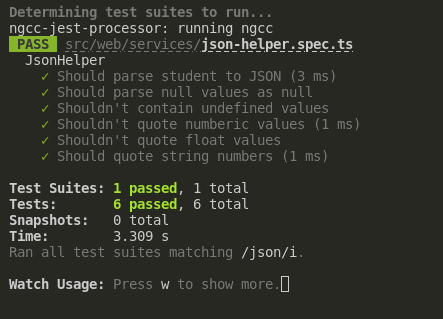
<fig>Green state.</fig>
</center>

#### Refatoração

```ts title="json-helper.ts" linenums="1"
public static parseObjectToJSON(object: Object): string {
        let jsonResponse = "{"

        const entries = Object.entries(object).filter(entry => entry[1] !== undefined)
        for (const entry of entries) {
            const [key, value] = entry
            jsonResponse += `"${key}":`;
            if (!value || typeof value === 'number')
                jsonResponse += value
            else
                jsonResponse += `"${value}"`
            if (entries.indexOf(entry) != entries.length - 1)
                jsonResponse += ","
        }
        jsonResponse += "}"
        return jsonResponse
    }

```

Validada pela execução correta dos testes.

<center>
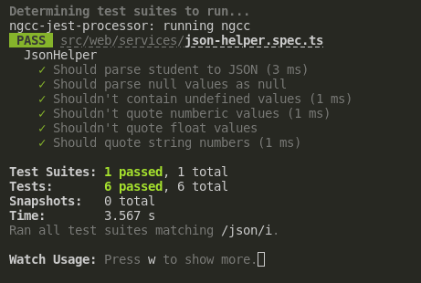
<fig>Testes em green state.</fig>
</center>

### Quinto Ciclo

Durante o quinto ciclo os enums serão tratados, para isso foi escolhido um enum do próprio projeto, disponível na classe `api-output.ts`, o `JoinState`, que corresponde a um dos atributos de `Student`.

```ts title="api-output.ts" linenums="1"
export enum JoinState {
  JOINED = "JOINED",
  NOT_JOINED = "NOT_JOINED",
}
```

#### Teste - Red State

```ts title="json-helper.spec.ts" linenums="1"
 it("Should parse enum as string", () => {
        const input: Student = {
            name: "John Doe",
            courseId: "TESTES",
            email: "email@test.com.zt",
            teamName: "PassaNada",
            sectionName: "T01",
            joinState: JoinState.JOINED
        };

        expect(JsonHelper.parseObjectToJSON(input)).toEqual(JSON.stringify(input))
    })
```

A execução dos testes apontou que essa especificação já estava contemplada na implementação. Portanto, o ciclo foi encerrado nesse instante.

<center>
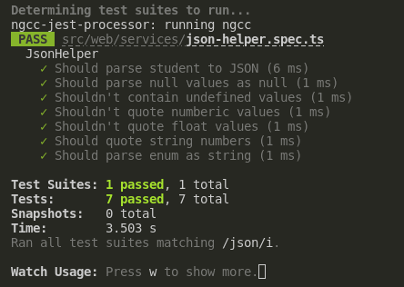
<fig>Indicação de Green State</fig>
</center>

### Sexto Ciclo

Durante o sexto ciclo, foi implementada o tratamento de valores do tipo `boolean`. Para isso foi utilizado um objeto do tipo `InstructorPermissionSet`.

```ts title="api-output.ts" linenums="1"
export interface InstructorPermissionSet {
  canModifyCourse: boolean;
  canModifyInstructor: boolean;
  canModifySession: boolean;
  canModifyStudent: boolean;
  canViewStudentInSections: boolean;
  canViewSessionInSections: boolean;
  canSubmitSessionInSections: boolean;
  canModifySessionCommentsInSections: boolean;
}
```

#### Teste - Red State

```ts title="json-helper.spec.ts" linenums="1"
it("Shouldn't quote boolean values", () => {
        const input: InstructorPermissionSet = {
            canModifyCourse: true,
            canModifyInstructor: true,
            canModifySession: true,
            canModifyStudent: true,
            canViewStudentInSections: false,
            canViewSessionInSections: false,
            canSubmitSessionInSections: true,
            canModifySessionCommentsInSections: true,
        };

        expect(JsonHelper.parseObjectToJSON(input)).toEqual(JSON.stringify(input))
    })
```

<center>
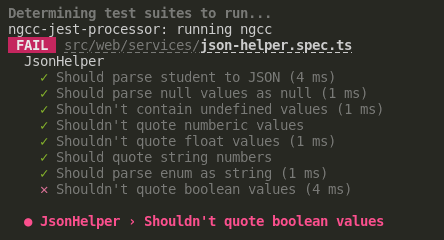

<fig>Indicação do RED State.</fig>
</center>

#### Implementação do Código

```ts title="json-helper.ts" linenums="1"
public static parseObjectToJSON(object: Object): string {
        let jsonResponse = "{"
        const nonQuotable = ['number', 'boolean']
        const entries = Object.entries(object).filter(entry => entry[1] !== undefined)
        for (const entry of entries) {
            const [key, value] = entry
            jsonResponse += `"${key}":`;
            if (!value || nonQuotable.indexOf(typeof value) != -1)
                jsonResponse += value
            else
                jsonResponse += `"${value}"`
            if (entries.indexOf(entry) != entries.length - 1)
                jsonResponse += ","
        }
        jsonResponse += "}"
        return jsonResponse
    }

```

#### Teste - Green State

<center>


<fig>Green state.</fig>
</center>

#### Refatoração

Não foi identificada necessidade de refatoração nesse ciclo.

### Sétimo Ciclo

Neste ciclo a conversão de objetos aninhados foi implementada. Para isso foi utilizado um objeto do tipo `FeedbackSessionLogEntry`, que contém um enum e um objeto aninhado.

```ts title="api-output.ts" linenums="1"

export interface FeedbackSessionLogEntry {
  studentData: Student;
  feedbackSessionLogType: FeedbackSessionLogType;
  timestamp: number;
}

export enum FeedbackSessionLogType {
  ACCESS = "access",
  SUBMISSION = "submission",
  VIEW_RESULT = "view result",
}
```

#### Teste - Red State

```ts title="json-helper.spec.ts" linenums="1"
```

<center>
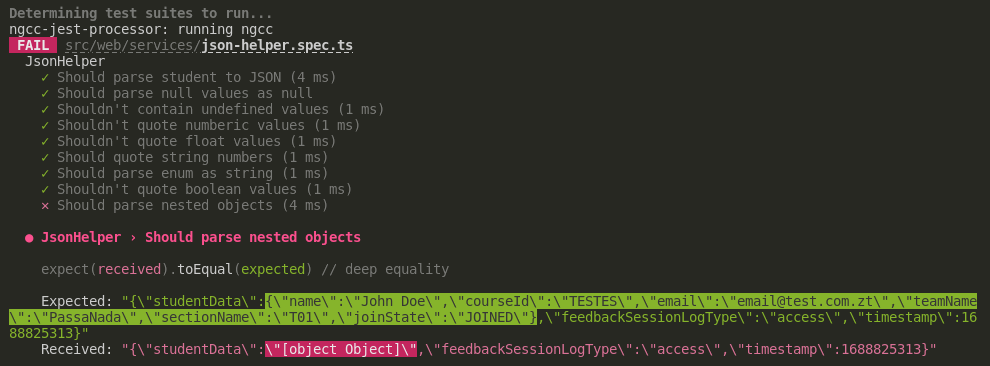

<fig>Indicação do RED State.</fig>
</center>

#### Implementação do Código

```ts title="json-helper.ts" linenums="1"
public static parseObjectToJSON(object: Object): string {
        let jsonResponse = "{"
        const nonQuotable = ['number', 'boolean']
        const entries = Object.entries(object).filter(entry => entry[1] !== undefined)
        for (const entry of entries) {
            const [key, value] = entry
            jsonResponse += `"${key}":`;
            if (!value || nonQuotable.indexOf(typeof value) != -1)
                jsonResponse += value
            else if (typeof value === 'object')
                jsonResponse += this.parseObjectToJSON(value)
            else
                jsonResponse += `"${value}"`
            if (entries.indexOf(entry) != entries.length - 1)
                jsonResponse += ","
        }
        jsonResponse += "}"
        return jsonResponse
    }
```

#### Teste - Green State

<center>
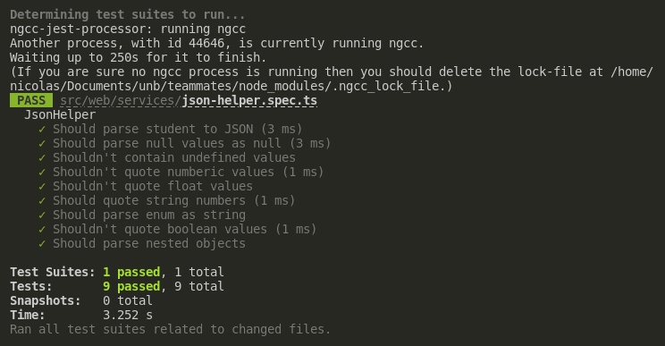
<fig>Green state.</fig>
</center>

#### Refatoração

Um novo teste foi adicionado, para identificar se há falhas na conversão de objetos com mais de um nível de aninhamento.

```ts title="json-helper.spec.ts" linenums="1"
it("Should parse nested objects with more levels", () => {
        const input: Object = {
            name: "John Doe",
            address: {
                country: {
                    code: "BR",
                    name: "Brazil"
                },
                city: {
                    state: "DF",
                    name: "Brasília"
                }
            }
        }

        expect(JsonHelper.parseObjectToJSON(input)).toEqual(JSON.stringify(input))
    })
```

E a execução deste teste apontou que essa especificação também foi contemplada.

<center>
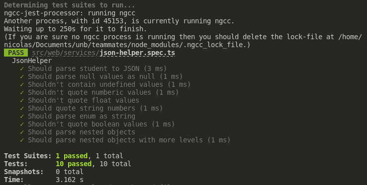
<fig>Situação de Green State.</fig>
</center>

## Código Fonte

| Descrição                | Link                                                                                                        |
| ------------------------ | ----------------------------------------------------------------------------------------------------------- |
| Código de teste          | [json-helper.spec.ts](https://github.com/nszchagas/teammates/blob/tdd/src/web/services/json-helper.spec.ts) |
| Código da funcionalidade | [json-helper.ts](https://github.com/nszchagas/teammates/blob/tdd/src/web/services/json-helper.ts)           |
| Commit                   | [Commit #cda69](https://github.com/nszchagas/teammates/commit/cda69ef105fcf779b4ab76c032d86533d8ac8999)     |

## Resultado Final da Execução dos Testes

<center>
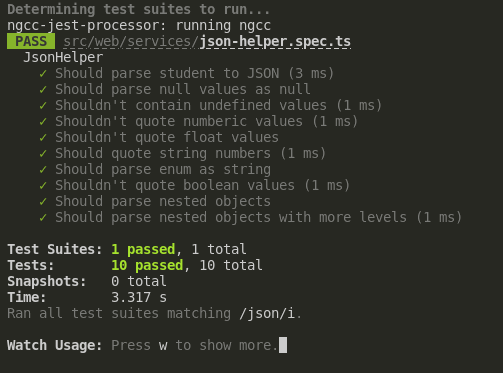
<fig>Resultado Final</fig>
</center>

## Conclusão
